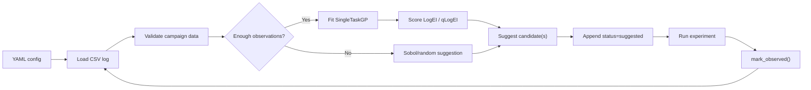

# 🧪 BO Forge v0.5.0

BO Forge is a notebook-first Bayesian optimisation campaign tool with a small terminal workflow and local Streamlit prototype. The reusable BO logic lives in the `bo_forge` Python package, while notebooks, the CLI, and the app wrap that package.

v0.5 adds the first local Streamlit wrapper around the existing `CampaignSession` workflow. Suggestions are staged as a dry run before the user explicitly appends them to the CSV log.

BO Forge deliberately supports only:

- continuous, integer, discrete, and categorical variables
- one objective
- maximize or minimize direction
- Sobol or random initial suggestions
- BoTorch `SingleTaskGP`
- LogEI for single suggestions and qLogEI for batches
- CSV campaign logs
- optional feasibility constraints
- optional cost-aware ranking and human review
- optional replicate tracking and replicate-aware aggregation
- resume from existing logs
- basic diagnostics
- a notebook-first `CampaignSession` workflow
- a small `bo-forge` CLI workflow
- a local Streamlit app prototype

It intentionally does not yet cover qNEI, learned noise models, multi-objective optimisation, or a production web backend.

---

## 🔁 Workflow



The Streamlit app is intentionally a thin wrapper.

Future interfaces should keep wrapping this backend package rather than moving BO logic into notebooks, CLI commands, or app code.

---

## 🗂️ Repository Structure

```text
bo-forge/
├── bo_forge/       # reusable backend package
├── bo_forge_app/   # local Streamlit wrapper
├── configs/        # YAML campaign configs
├── examples/       # seed CSV logs and runnable scripts
├── notebooks/      # notebook-first campaign workflows with 15-step demos
├── reports/        # generated local reports and figures
├── docs/           # quickstart, CLI, schema, troubleshooting, repo guide
└── tests/          # pytest coverage
```
---

## 📚 Documentation

- [docs/QUICKSTART.md](docs/QUICKSTART.md): setup, quickstart commands, session API example, notebooks, and diagnostics.
- [docs/CLI.md](docs/CLI.md): terminal workflow and command reference.
- [docs/STREAMLIT_APP.md](docs/STREAMLIT_APP.md): local Streamlit app setup and workflow.
- [docs/CLI_ERROR_EXAMPLES.md](docs/CLI_ERROR_EXAMPLES.md): intentional CLI failures with expected error and hint output.
- [docs/CSV_SCHEMA.md](docs/CSV_SCHEMA.md): canonical CSV columns, allowed values, blanks, and status transitions.
- [docs/COMMON_ERRORS.md](docs/COMMON_ERRORS.md): troubleshooting guide for common YAML and CSV errors.
- [docs/REPOSITORY_STRUCTURE.md](docs/REPOSITORY_STRUCTURE.md): detailed package layout and development workflow.
- [ROADMAP.md](ROADMAP.md): completed milestones and planned direction.

---

## 📌 Tested Versions

The primary dependency source is `pyproject.toml`.

A direct-dependency snapshot from the v0.5.0 environment is recorded in `requirements-lock.txt`.

---

## 👤 Author

Angze Li
