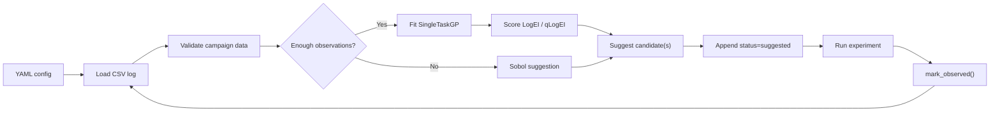

# 🧪 BO Forge v0.3.1

BO Forge is a notebook-first Bayesian optimisation campaign tool with a small terminal workflow. The reusable BO logic lives in the `bo_forge` Python package, while notebooks and the CLI wrap that package.

v0.3 adds a `bo-forge` CLI around the existing `CampaignSession` workflow: validate campaign logs, inspect state, generate suggestions, append suggestions, mark results observed, export reports, and save plots from the terminal. v0.3.1 adds a robust `python -m bo_forge` module entrypoint for notebooks and editable environments.

BO Forge deliberately supports only:

- continuous variables
- one objective
- maximize or minimize direction
- Sobol initial suggestions
- BoTorch `SingleTaskGP`
- LogEI for single suggestions and qLogEI for batches
- CSV campaign logs
- resume from existing logs
- basic diagnostics
- a notebook-first `CampaignSession` workflow
- a small `bo-forge` CLI workflow

It intentionally does not yet cover categorical variables, constraints, noisy BO, multi-objective optimisation, or an app UI.

---

## 🔁 Workflow



The app/UI layer is intentionally absent in this MVP.

Future interfaces should wrap this backend package rather than moving BO logic into notebooks, CLI commands, or app code.

---

## 🗂️ Repository Structure

```text
bo-forge/
├── bo_forge/       # reusable backend package
├── configs/        # YAML campaign configs
├── examples/       # seed CSV logs and runnable scripts
├── notebooks/      # notebook-first campaign workflows
├── reports/        # generated local reports and figures
├── docs/           # quickstart, CLI, schema, troubleshooting, repo guide
└── tests/          # pytest coverage
```
---

## 📚 Documentation

- [docs/QUICKSTART.md](docs/QUICKSTART.md): setup, quickstart commands, session API example, notebooks, and diagnostics.
- [docs/CLI.md](docs/CLI.md): terminal workflow and command reference.
- [docs/CSV_SCHEMA.md](docs/CSV_SCHEMA.md): canonical CSV columns, allowed values, blanks, and status transitions.
- [docs/COMMON_ERRORS.md](docs/COMMON_ERRORS.md): troubleshooting guide for common YAML and CSV errors.
- [docs/REPOSITORY_STRUCTURE.md](docs/REPOSITORY_STRUCTURE.md): detailed package layout and development workflow.
- [ROADMAP.md](ROADMAP.md): completed milestones and planned direction.

---

## 📌 Tested Versions

The primary dependency source is `pyproject.toml`.

A direct-dependency snapshot from the v0.3.1 environment is recorded in `requirements-lock.txt`.

---

## 👤 Author 

Angze Li
