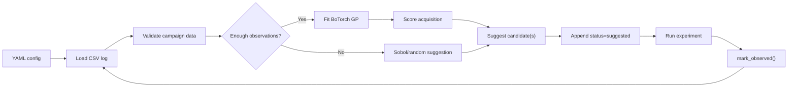

# 🧪 BO Forge v1.4.0

BO Forge is a practical Bayesian optimisation campaign tool with notebook, CLI, and local Streamlit workflows. The reusable BO logic lives in the `bo_forge` Python package, while notebooks, the CLI, and the app wrap that package.

v1.4.0 adds BO Forge's first conservative multi-fidelity workflow: single-objective continuous-fidelity qMFKG through BoTorch's current multi-fidelity stack.

Existing single-objective, multi-objective, structured, cost, review, replicate, CLI, notebook, Streamlit, service, and API workflows remain backward compatible with the v1.3.4 structured Streamlit baseline.

BO Forge deliberately supports only:

- continuous, integer, discrete, and categorical variables
- single-objective campaigns, plus coupled multi-objective campaigns with `m >= 2` objectives
- maximize or minimize direction
- Sobol or random initial suggestions
- BoTorch `SingleTaskGP`
- LogEI/qLogEI for standard single-objective campaigns, qMFKG for conservative single-objective multi-fidelity campaigns, and qLogEHVI for coupled multi-objective campaigns
- CSV campaign logs
- optional feasibility constraints
- optional cost-aware ranking and human review
- optional replicate tracking, replicate-derived observation variance, and replicate-aware aggregation
- optional structured/staged campaign logs with stage-aware validation, explicit stage-aware suggestions, and read-only stage diagnostics
- optional single-objective multi-fidelity qMFKG with one continuous fidelity variable
- resume from existing logs
- basic diagnostics, Pareto-front plots, and hypervolume progress
- a notebook-first `CampaignSession` workflow
- a small `bo-forge` CLI workflow
- a local Streamlit workbench
- an internal app service layer that delegates BO behavior to `CampaignSession`
- an optional experimental FastAPI probe for local/trusted-network exploration

It intentionally does not yet cover multi-objective multi-fidelity, structured multi-fidelity, cost-aware multi-fidelity, replicate-aware multi-fidelity, automatic stage transitions, Streamlit structured campaign creation, cost-aware structured campaigns, qLogNEI/qLogNEHVI, learned noise models, decoupled or asynchronous multi-objective evaluation, learned cost models, cost-as-objective optimization, database-backed storage, or a production multi-user web backend. The primary tested multi-objective range is `2 <= m <= 4`; larger objective counts are advanced usage because qLogEHVI, non-dominated partitioning, hypervolume, and visualization become more expensive.

---

## 🧰 Install

Install the backend package and CLI:

```bash
pip install bo-forge
```

Install the local Streamlit workbench:

```bash
pip install "bo-forge[app]"
```

Install the experimental API probe:

```bash
pip install "bo-forge[api]"
```

For local development from a clone:

```bash
python3 -m venv .venv
./.venv/bin/pip install -e ".[dev]"
```

Check the installed version and environment:

```bash
bo-forge --version
bo-forge doctor
```

Launch the packaged local app:

```bash
bo-forge-app
```

The app module entrypoint is also supported:

```bash
python -m bo_forge_app
```

For trusted LAN access:

```bash
bo-forge-app --host 0.0.0.0 --port 8501
```

BO Forge has no built-in authentication. Use network access only on a trusted
LAN, VPN, SSH tunnel, or externally authenticated reverse proxy. See
[docs/STREAMLIT_DEPLOYMENT.md](https://github.com/angzeli/bo-forge/blob/main/docs/STREAMLIT_DEPLOYMENT.md)
before sharing the app beyond one local machine.

On macOS, you can create an optional double-click launcher:

```bash
bo-forge-app --make-launcher ~/Desktop/BO-Forge.command
```

Launch the experimental API probe:

```bash
bo-forge-api --root . --host 127.0.0.1 --port 8765
```

The API probe has no built-in authentication and is not a production backend.
See [docs/API_PROBE.md](https://github.com/angzeli/bo-forge/blob/main/docs/API_PROBE.md)
before using it beyond localhost.

---

## 🔁 Workflow



The Streamlit app is intentionally a thin wrapper.

Future interfaces should keep wrapping this backend package rather than moving BO logic into notebooks, CLI commands, or app code.

The bundled multi-fidelity example is `configs/15_multi_fidelity_qmfkg.yaml`
with seed log `examples/15_multi_fidelity_qmfkg_campaign_log.csv`.

---

## 🗂️ Repository Structure

```text
bo-forge/
├── bo_forge/       # reusable backend package
├── bo_forge_app/   # local Streamlit wrapper
├── configs/        # YAML campaign configs
├── examples/       # seed CSV logs and runnable scripts
├── notebooks/      # notebook-first campaign workflows and deeper simulated demos
├── reports/        # generated local reports and figures
├── docs/           # quickstart, CLI, schema, troubleshooting, repo guide
└── tests/          # pytest coverage
```
---

## 📚 Documentation

- [docs/QUICKSTART.md](https://github.com/angzeli/bo-forge/blob/main/docs/QUICKSTART.md): setup, quickstart commands, session API example, notebooks, and diagnostics.
- [docs/INSTALLATION.md](https://github.com/angzeli/bo-forge/blob/main/docs/INSTALLATION.md): pip install tutorial for core, app, development, wheel, and sdist installs.
- [docs/CLI.md](https://github.com/angzeli/bo-forge/blob/main/docs/CLI.md): terminal workflow and command reference.
- [docs/STREAMLIT_APP.md](https://github.com/angzeli/bo-forge/blob/main/docs/STREAMLIT_APP.md): local Streamlit app setup and workflow.
- [docs/STREAMLIT_DEPLOYMENT.md](https://github.com/angzeli/bo-forge/blob/main/docs/STREAMLIT_DEPLOYMENT.md): safe local, trusted-LAN, SSH/VPN, and authenticated reverse-proxy deployment guidance.
- [docs/API_PROBE.md](https://github.com/angzeli/bo-forge/blob/main/docs/API_PROBE.md): experimental optional FastAPI probe usage and safety model.
- [docs/09_APP_CREATED_CAMPAIGN_TUTORIAL.md](https://github.com/angzeli/bo-forge/blob/main/docs/09_APP_CREATED_CAMPAIGN_TUTORIAL.md): step-by-step tutorial for creating a new campaign inside the app.
- [docs/CLI_ERROR_EXAMPLES.md](https://github.com/angzeli/bo-forge/blob/main/docs/CLI_ERROR_EXAMPLES.md): intentional CLI failures with expected error and hint output.
- [docs/CSV_SCHEMA.md](https://github.com/angzeli/bo-forge/blob/main/docs/CSV_SCHEMA.md): canonical CSV columns, allowed values, blanks, and status transitions.
- [docs/COMMON_ERRORS.md](https://github.com/angzeli/bo-forge/blob/main/docs/COMMON_ERRORS.md): troubleshooting guide for common YAML and CSV errors.
- [docs/PUBLIC_API.md](https://github.com/angzeli/bo-forge/blob/main/docs/PUBLIC_API.md): stable public imports supported by the `bo_forge` package.
- [docs/RELEASE_CHECKLIST.md](https://github.com/angzeli/bo-forge/blob/main/docs/RELEASE_CHECKLIST.md): GitHub and PyPI release checklist.
- [docs/REPOSITORY_STRUCTURE.md](https://github.com/angzeli/bo-forge/blob/main/docs/REPOSITORY_STRUCTURE.md): detailed package layout and development workflow.
- [CHANGELOG.md](https://github.com/angzeli/bo-forge/blob/main/CHANGELOG.md): release history.
- [ROADMAP_V0_TO_V1.md](https://github.com/angzeli/bo-forge/blob/main/ROADMAP_V0_TO_V1.md): completed milestones through v1.0.0.
- [ROADMAP_V1_X.md](https://github.com/angzeli/bo-forge/blob/main/ROADMAP_V1_X.md): v1.x direction.

---

## 📌 Tested Versions

The primary dependency source is `pyproject.toml`.

A direct-dependency snapshot from the v1.4.0 environment is recorded in `requirements-lock.txt`.

---

## 👤 Author

Angze Li
