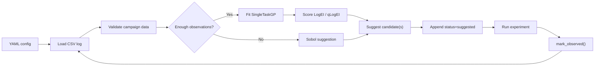

# 🧪 BO Forge MVP v0.1.2

BO Forge is a notebook-first Bayesian optimisation campaign tool. The notebook is the user workflow, while the reusable BO logic lives in the `bo_forge` Python package.

MVP v0.1 is a sequential campaign demo: define a problem, load a CSV log, suggest one experiment, enter one result, reload the log, and repeat.

MVP v0.1 deliberately supports only:

- continuous variables
- one objective
- maximize or minimize direction
- Sobol initial suggestions
- BoTorch `SingleTaskGP`
- LogEI for single suggestions and qLogEI for batches
- CSV campaign logs
- resume from existing logs
- basic diagnostics

It intentionally does not yet cover categorical variables, constraints, noisy BO, multi-objective optimisation, a CLI, or an app UI.

## 🔁 Workflow



The app/UI layer is intentionally absent in this MVP. 

Future interfaces should wrap this backend package rather than moving BO logic into notebooks or app code.

## 🚀 Setup 

Create a dedicated environment at the project root:

```bash
python3 -m venv .venv
./.venv/bin/pip install -e ".[dev]"
```

The `dev` extra includes pytest, Ruff, and enough Jupyter tooling to open and execute the example notebook from a fresh clone.

Run the test suite:

```bash
./.venv/bin/pytest
```

Run lint checks:

```bash
./.venv/bin/ruff check .
```

## ✅ Quickstart 

Run the clean script example:

```bash
./.venv/bin/python examples/quickstart.py
```

It copies the seed CSV log to an ignored working file, requests one suggestion, simulates one result, records that result with `mark_observed()`, and reloads the campaign log.

The same workflow in minimal Python:

```python
from pathlib import Path
import shutil

from bo_forge import (
    CampaignConfig,
    append_suggestions,
    load_campaign_log,
    mark_observed,
    suggest_next,
)

config = CampaignConfig.from_yaml("configs/simple_2d.yaml")
seed_log_path = Path("examples/simple_2d_campaign_log.csv")
log_path = Path("examples/simple_2d_working_log.csv")
shutil.copyfile(seed_log_path, log_path)

df = load_campaign_log(log_path, config)
suggestions = suggest_next(config, df)
append_suggestions(log_path, suggestions)

# After running the suggested experiment:
mark_observed(log_path, row_id=suggestions.loc[0, "row_id"], objective_value=1.95)
```

## 🧾 Canonical CSV Schema

Campaign logs use this column order:

```text
row_id,iteration,status,source,<variable columns...>,<objective column>,predicted_mean,predicted_std,acquisition
```

Rules:

- `status` is `suggested` or `observed`.
- `source` is `manual`, `sobol`, `log_ei`, or `qlog_ei`.
- Suggested rows have blank objective values.
- Observed rows require objective values.
- A suggested experiment becomes observed by updating the same row with `mark_observed()`.
- `row_id`, `iteration`, `source`, and variable values are preserved when a result is entered.

See `CSV_SCHEMA.md` for the full column reference, allowed blank values, and status-transition rules.

## ⚙️ Example Configs

- `configs/simple_2d.yaml`: maximises photocatalyst-style `activity`.
- `configs/simple_2d_minimize.yaml`: minimises process `defect_rate`.

## 📓 Example Notebook 

Open `notebooks/01_simulated_campaign.ipynb` for a simulated end-to-end maximisation campaign using `configs/simple_2d.yaml` and `examples/simple_2d_campaign_log.csv`.

Open `notebooks/02_minimization_campaign.ipynb` for a shorter minimisation campaign using `configs/simple_2d_minimize.yaml` and `examples/simple_2d_minimize_campaign_log.csv`. It fills the Sobol initial design, then demonstrates one qLogEI batch BO round.

From a fresh clone:

```bash
python3 -m venv .venv
./.venv/bin/pip install -e ".[dev]"
./.venv/bin/jupyter notebook notebooks/01_simulated_campaign.ipynb
```

The notebook demonstrates the real sequential workflow:

1. load the current log
2. request one candidate
3. append it as `status=suggested`
4. run one experiment
5. enter one result with `mark_observed()`
6. reload the log and repeat

The diagnostics use `bo_forge/plot_style.py`, which captures the bold axes, thicker spines, compact legends, and figure sizing used throughout the local PyTorch & BoTorch tutorial notebooks.

The notebook writes only ignored working files:

- `examples/simple_2d_working_log.csv`
- `examples/latest_suggestions.csv`

## 📊 Diagnostics 

The plotting helpers produce report-ready black-on-white figures, even when the notebook or IDE uses a dark theme. `plot_progress()` shows observed and best-so-far objective values, while `plot_diagnostics()` shows the observed design space for one- or two-variable campaigns.

Both functions return `(fig, ax)` and can optionally save figures:

```python
from bo_forge.diagnostics import plot_progress

plot_progress(config, df, filename="progress.png")
```

## 🛠️ Troubleshooting CSV/YAML Errors

BO Forge is intentionally strict because users edit YAML and CSV files by hand.

Common errors:

- `Variable 'temperature' has lower >= upper`: check the YAML `lower` and `upper` values.
- `Campaign log must start with canonical columns`: make sure the CSV begins with `row_id,iteration,status,source`.
- `status='observed' but objective ... is blank`: fill the objective value or change the row back to `suggested`.
- `status='suggested' but objective ... is filled`: suggested rows must leave the objective blank until `mark_observed()` is called.
- `Cannot generate new suggestions while unresolved status='suggested' rows exist`: run the experiment and call `mark_observed()` before requesting another suggestion.
- `Row ... has invalid source`: use only `manual`, `sobol`, `log_ei`, or `qlog_ei`.
- `Duplicate row_id`: every row needs a unique `row_id`.
- `Variable ... is outside bounds`: check the variable value against the YAML bounds.

When in doubt, run:

```python
from bo_forge import CampaignConfig, load_campaign_log, validate_campaign_data

config = CampaignConfig.from_yaml("configs/simple_2d.yaml")
df = load_campaign_log("examples/simple_2d_campaign_log.csv", config)
validate_campaign_data(config, df)
```

See `COMMON_ERRORS.md` for a longer error-message reference with fixes.

## 🗂️ Repository Guide

See `REPOSITORY_STRUCTURE.md` for the package layout, file responsibilities, and recommended development workflow.

## 📌 Tested Versions

The primary dependency source is `pyproject.toml`. A direct-dependency snapshot from the v0.1.2 environment is recorded in `requirements-lock.txt`.

## 👤 Author 

Angze Li
