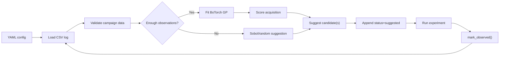

# 🧪 BO Forge v3.1.1

BO Forge is a practical Bayesian optimisation campaign tool with notebook, CLI, and local Streamlit workflows. The reusable BO logic lives in the `bo_forge` Python package, while notebooks, the CLI, and the app wrap that package.

v3.1.1 hardens the opt-in durable provenance foundation introduced in v3.1.0
without changing BO numerical behavior or YAML/CSV campaign schemas. Campaign
loading now supports compatible or managed-only resume policy, provenance
mismatches have stable diagnostic reason codes, and interrupted managed writes
require an explicit recovery action. Existing campaigns remain
legacy-compatible and are not silently adopted.

Existing campaign configs, CSV logs, BO behavior, campaign CLI commands,
notebooks, service calls, API payloads, and launcher safeguards remain
compatible. The Streamlit workbench now organizes work into `Campaign`, `Run`,
and `Analyze`, with native Day/Night theme state and the same explicit mutation
and staged-suggestion safeguards.

BO Forge deliberately supports only:

- continuous, integer, discrete, and categorical variables
- single-objective campaigns, plus coupled multi-objective campaigns with `m >= 2` objectives
- maximize or minimize direction
- Sobol or random initial suggestions
- BoTorch `SingleTaskGP` and `SingleTaskMultiFidelityGP`
- optional single-objective model profiles: `default`, `smooth`, `rough`, and `robust`
- LogEI/qLogEI and qLogNEI for supported single-objective campaigns, qMFKG for conservative single-objective multi-fidelity campaigns, and qLogEHVI/qLogNEHVI for coupled multi-objective campaigns
- CSV campaign logs
- optional feasibility constraints
- optional cost-aware ranking and human review
- optional replicate tracking, replicate-derived observation variance, and replicate-aware aggregation
- optional structured/staged campaign logs with stage-aware validation, explicit stage-aware suggestions, and read-only stage diagnostics
- optional single-objective multi-fidelity qMFKG with one continuous fidelity variable, optional ordered numeric levels, batches of one through four, and read-only fidelity coverage/progress diagnostics
- optional single-objective contextual LogEI/qLogEI with context variables fixed at suggestion time, including review, deterministic cost, and replicate combinations
- resume from existing logs
- basic diagnostics, model diagnostics, model-profile comparison plots, Pareto-front plots, and hypervolume progress
- a notebook-first `CampaignSession` workflow
- a small `bo-forge` CLI workflow
- a local Streamlit workbench
- an internal app service layer that delegates BO behavior to `CampaignSession`
- an optional experimental FastAPI probe with preferred server-managed staging
  for local/trusted-network exploration
- coordinated append, review, and observation writes across local processes
- optional provenance-managed campaigns with config/log hashes and mutation lineage

It intentionally does not yet cover non-default model profiles for multi-objective, multi-fidelity, or structured campaigns, contextual combinations with multi-objective, structured, multi-fidelity, or qLogNEI/qLogNEHVI, multi-objective multi-fidelity, structured multi-fidelity, cost-aware multi-fidelity, replicate-aware multi-fidelity, named fidelity sources, per-level fidelity costs, qMFKG batches above four, automatic stage transitions, cost-aware structured campaigns, cost-aware qLogNEI, cost-aware qLogNEHVI, replicate-aware qLogNEHVI, structured qLogNEI/qLogNEHVI, learned noise models, decoupled or asynchronous multi-objective evaluation, learned cost models, cost-as-objective optimization, database-backed storage, or a production multi-user web backend. The primary tested multi-objective range is `2 <= m <= 4`; larger objective counts are advanced usage because qLogEHVI/qLogNEHVI, non-dominated partitioning, hypervolume, and visualization become more expensive.

---

## 🧰 Install

Install the backend package and CLI:

```bash
pip install bo-forge
```

Install the local Streamlit workbench:

```bash
pip install "bo-forge[app]"
```

Install the experimental API probe:

```bash
pip install "bo-forge[api]"
```

For local development from a clone:

```bash
python3.12 -m venv .venv
./.venv/bin/python -m pip install "uv==0.11.3"
./.venv/bin/uv pip install --python ./.venv/bin/python \
  --require-hashes -r requirements/constraints-py312-macos-arm64.txt
./.venv/bin/uv pip install --python ./.venv/bin/python \
  --no-deps --no-build-isolation -e .
```

Choose the generated constraint file matching your interpreter and platform;
Linux CPU environments also pass `--torch-backend cpu`. See
[`requirements/README.md`](https://github.com/angzeli/bo-forge/blob/main/requirements/README.md).

Check the installed version and environment:

```bash
bo-forge --version
bo-forge doctor
```

Launch the packaged local app:

```bash
bo-forge-app
```

The app module entrypoint is also supported:

```bash
python -m bo_forge_app
```

For trusted LAN access:

```bash
bo-forge-app --host 0.0.0.0 --port 8501 --allow-network-access
```

BO Forge has no built-in authentication. Use network access only on a trusted
LAN, VPN, SSH tunnel, or externally authenticated reverse proxy. See
[docs/STREAMLIT_DEPLOYMENT.md](https://github.com/angzeli/bo-forge/blob/main/docs/STREAMLIT_DEPLOYMENT.md)
before sharing the app beyond one local machine.

On macOS, you can create an optional double-click launcher:

```bash
bo-forge-app --make-launcher ~/Desktop/BO-Forge.command
```

Launch the experimental API probe:

```bash
bo-forge-api --root . --host 127.0.0.1 --port 8765
```

Server-managed API stages are held in memory for 30 minutes by default. Limits
can be changed for one launcher process:

```bash
bo-forge-api --root . --stage-ttl-seconds 1800 --max-staged-batches 128
```

Network binds require explicit acknowledgement:

```bash
bo-forge-api --root . --host 0.0.0.0 --port 8765 --allow-network-access
```

Trusted deployments can require server-managed append and disable interactive
API documentation:

```bash
bo-forge-api --root . --server-stages-only --no-docs
```

For API clients, server-managed staging is preferred. The API probe has no
built-in authentication and is not a production backend.
API clients can list active or terminal stage metadata and explicitly renew a
file-valid active stage; reads never extend a stage lifetime automatically.
Stages disappear when the API process restarts, and stage IDs are not
authentication credentials. The earlier client-carried staged-bundle append
path remains available as a trusted-client compatibility workflow.
See [docs/API_PROBE.md](https://github.com/angzeli/bo-forge/blob/main/docs/API_PROBE.md)
and [docs/API_SECURITY.md](https://github.com/angzeli/bo-forge/blob/main/docs/API_SECURITY.md)
before using it beyond localhost.

---

## 🔁 Workflow

Initialize a new provenance-managed campaign with:

```bash
bo-forge init-log --config configs/my_campaign.yaml --log work/campaign.csv
bo-forge provenance --config configs/my_campaign.yaml --log work/campaign.csv
bo-forge validate --config configs/my_campaign.yaml --log work/campaign.csv \
  --require-provenance
```

The first command creates both the canonical CSV and
`work/campaign.csv.manifest.json`. Existing CSV campaigns without a manifest
continue unchanged. Move and back up a managed CSV together with its sidecar; schema v1
cannot distinguish a deliberately removed sidecar from a genuine legacy CSV. See
[docs/PROVENANCE.md](https://github.com/angzeli/bo-forge/blob/main/docs/PROVENANCE.md).
If inspection reports a recoverable interrupted transaction, run
`bo-forge provenance-recover` with the current log fingerprint before resuming.


```mermaid
flowchart LR
    A["YAML config"] --> B["Load CSV log"]
    B --> C["Validate campaign data"]
    C --> D{"Enough observations?"}
    D -- "No" --> E["Sobol/random suggestion"]
    D -- "Yes" --> F["Fit BoTorch GP"]
    F --> G["Score acquisition"]
    G --> H["Suggest candidate(s)"]
    E --> H
    H --> I["Append status=suggested"]
    I --> J["Run experiment"]
    J --> K["mark_observed()"]
    K --> B
```

The Streamlit app is intentionally a thin wrapper.

Future interfaces should keep wrapping this backend package rather than moving BO logic into notebooks, CLI commands, or app code.

The bundled multi-fidelity example is `configs/15_multi_fidelity_qmfkg.yaml`
with seed log `examples/15_multi_fidelity_qmfkg_campaign_log.csv`. Inspect it
with `campaign.fidelity_summary()`, `campaign.fidelity_coverage()`,
`bo-forge fidelity-summary`, `bo-forge fidelity-coverage`, or the
`fidelity-diagnostics` and `fidelity-progress` plots; the notebook walkthrough is
`notebooks/15_multi_fidelity_qmfkg_campaign.ipynb`.

The ordered-discrete and batch qMFKG example is
`configs/22_discrete_multi_fidelity_qmfkg.yaml` with seed log
`examples/22_discrete_multi_fidelity_qmfkg_campaign_log.csv`. It constrains the
continuous fidelity variable to four numeric levels and demonstrates qMFKG
batches through `notebooks/22_discrete_multi_fidelity_qmfkg_campaign.ipynb`.
Continuous batches use joint one-shot optimization; ordered-discrete batches
use BoTorch's conditioned greedy mixed optimization and report one joint
post-selection acquisition value.
qMFKG runtime grows with batch size, fidelity levels, fantasies, restarts, and
raw samples. Optional `fidelity.optimizer_maxiter` and
`fidelity.optimizer_timeout_seconds` settings provide a user-selected safety limit;
the timeout covers acquisition optimization after model fitting, and BO Forge
rejects candidates returned after the shared deadline. BoTorch
initial-condition generation and in-flight calls cannot be cancelled
immediately, so the command can return later than the configured limit. The
setting is not a candidate-quality guarantee.

The bundled contextual example is `configs/16_contextual_logei.yaml` with seed
log `examples/16_contextual_logei_campaign_log.csv`. Generate contextual
suggestions with `CampaignSession.suggest_next(context_values={...})` or
`bo-forge suggest --context feedstock_acidity=0.25`, inspect context
combinations with `campaign.context_summary()` or `bo-forge context-summary`,
and export diagnostics with `bo-forge plot --kind context-diagnostics`. The
notebook walkthrough is `notebooks/16_contextual_logei_campaign.ipynb`.
Streamlit can also create `Campaign kind = Contextual LogEI` configs with
selected context variables and optional defaults.

The bundled model-profile example is `configs/17_model_profile_logei.yaml` with
seed log `examples/17_model_profile_campaign_log.csv`. Inspect profile and
fitting inputs with `campaign.model_summary()` or `bo-forge model-summary`, and
compare candidate profiles with `campaign.model_profile_comparison()` or
`bo-forge model-compare`. Model comparison is diagnostic only. It does not automatically select a model or change the configured profile. Export
posterior-vs-observed diagnostics with `bo-forge plot --kind model-diagnostics`
and profile comparison diagnostics with `bo-forge plot --kind model-comparison`.
The notebook walkthrough is `notebooks/17_model_profile_logei_campaign.ipynb`.

The bundled qLogNEI example is `configs/18_noisy_pending_qlognei.yaml` with
seed log `examples/18_noisy_pending_qlognei_campaign_log.csv`. It demonstrates
accepted pending review suggestions being passed to qLogNEI as `X_pending`.
The tutorial walkthrough is `notebooks/18_noisy_pending_qlognei_campaign.ipynb`.

The bundled qLogNEHVI example is `configs/19_multi_objective_qlognehvi.yaml`
with seed log `examples/19_multi_objective_qlognehvi_campaign_log.csv`. It
demonstrates `bo.acquisition: qlog_nehvi` for coupled noisy multi-objective
suggestions with accepted pending review rows passed as `X_pending`. The
implementation scope and deferred combinations are documented in
`docs/QLOGNEHVI_FEASIBILITY.md`.

The bundled contextual cost-review example is
`configs/20_contextual_cost_review_logei.yaml` with seed log
`examples/20_contextual_cost_review_campaign_log.csv`. It demonstrates
single-objective contextual LogEI with optional review, deterministic cost,
campaign-global budget accounting across contexts, and `source=cost_log_ei`
model-based suggestions. The tutorial walkthrough is
`notebooks/20_contextual_cost_review_logei_campaign.ipynb`.

The contextual replicate example is
`configs/21_contextual_replicate_logei.yaml` with seed log
`examples/21_contextual_replicate_campaign_log.csv`. It includes two contexts,
an observed repeated group, review metadata, and deterministic cost. Active
`uncertain_best` repeats only target groups matching the requested context;
the GP still trains on group means from every context.

---

## 🗂️ Repository Structure

```text
bo-forge/
├── .github/        # required CI and validation-only future tag gate
├── bo_forge/       # reusable backend package
├── bo_forge_app/   # local Streamlit wrapper
├── bo_forge_api/   # optional FastAPI transport package
├── configs/        # YAML campaign configs
├── examples/       # seed CSV logs and runnable scripts
├── notebooks/      # notebook-first campaign workflows and deeper simulated demos
├── reports/        # generated local reports and figures
├── docs/           # quickstart, CLI, schema, troubleshooting, repo guide
├── requirements/   # generated, hashed Python/platform constraints
└── tests/          # pytest coverage
```
---

## 📚 Documentation

- [docs/QUICKSTART.md](https://github.com/angzeli/bo-forge/blob/main/docs/QUICKSTART.md): setup, quickstart commands, session API example, notebooks, and diagnostics.
- [docs/INSTALLATION.md](https://github.com/angzeli/bo-forge/blob/main/docs/INSTALLATION.md): pip install tutorial for core, app, development, wheel, and sdist installs.
- [docs/CLI.md](https://github.com/angzeli/bo-forge/blob/main/docs/CLI.md): terminal workflow and command reference.
- [docs/STREAMLIT_APP.md](https://github.com/angzeli/bo-forge/blob/main/docs/STREAMLIT_APP.md): local Streamlit app setup and workflow.
- [docs/STREAMLIT_DEPLOYMENT.md](https://github.com/angzeli/bo-forge/blob/main/docs/STREAMLIT_DEPLOYMENT.md): safe local, trusted-LAN, SSH/VPN, and authenticated reverse-proxy deployment guidance.
- [docs/API_PROBE.md](https://github.com/angzeli/bo-forge/blob/main/docs/API_PROBE.md): experimental optional FastAPI probe usage and safety model.
- [docs/API_SECURITY.md](https://github.com/angzeli/bo-forge/blob/main/docs/API_SECURITY.md): API assets, trust boundaries, deployment safeguards, and deferred production requirements.
- [docs/PROVENANCE.md](https://github.com/angzeli/bo-forge/blob/main/docs/PROVENANCE.md): managed campaign identity, mutation ledger, recovery, and trust boundary.
- [docs/CAPABILITY_MATRIX.md](https://github.com/angzeli/bo-forge/blob/main/docs/CAPABILITY_MATRIX.md): supported, read-only, rejected, and deferred feature combinations.
- [docs/09_APP_CREATED_CAMPAIGN_TUTORIAL.md](https://github.com/angzeli/bo-forge/blob/main/docs/09_APP_CREATED_CAMPAIGN_TUTORIAL.md): step-by-step tutorial for creating a new campaign inside the app.
- [docs/CLI_ERROR_EXAMPLES.md](https://github.com/angzeli/bo-forge/blob/main/docs/CLI_ERROR_EXAMPLES.md): intentional CLI failures with expected error and hint output.
- [docs/CSV_SCHEMA.md](https://github.com/angzeli/bo-forge/blob/main/docs/CSV_SCHEMA.md): canonical CSV columns, allowed values, blanks, and status transitions.
- [docs/COMMON_ERRORS.md](https://github.com/angzeli/bo-forge/blob/main/docs/COMMON_ERRORS.md): troubleshooting guide for common YAML and CSV errors.
- [docs/PUBLIC_API.md](https://github.com/angzeli/bo-forge/blob/main/docs/PUBLIC_API.md): stable public imports supported by the `bo_forge` package.
- [docs/MIGRATION_V3.md](https://github.com/angzeli/bo-forge/blob/main/docs/MIGRATION_V3.md): v3 module facades, UI mapping, API isolation, and figure changes.
- [docs/RELEASE_CHECKLIST.md](https://github.com/angzeli/bo-forge/blob/main/docs/RELEASE_CHECKLIST.md): GitHub and PyPI release checklist.
- [docs/REPOSITORY_STRUCTURE.md](https://github.com/angzeli/bo-forge/blob/main/docs/REPOSITORY_STRUCTURE.md): detailed package layout and development workflow.
- [CONTRIBUTING.md](https://github.com/angzeli/bo-forge/blob/main/CONTRIBUTING.md): constrained development setup and contribution checks.
- [SECURITY.md](https://github.com/angzeli/bo-forge/blob/main/SECURITY.md): supported release and private vulnerability-reporting guidance.
- [requirements/README.md](https://github.com/angzeli/bo-forge/blob/main/requirements/README.md): generated constraint sets and regeneration commands.
- [CHANGELOG.md](https://github.com/angzeli/bo-forge/blob/main/CHANGELOG.md): release history.
- [ROADMAP_V0_TO_V1.md](https://github.com/angzeli/bo-forge/blob/main/ROADMAP_V0_TO_V1.md): completed milestones through v1.0.0.
- [ROADMAP_V1_X.md](https://github.com/angzeli/bo-forge/blob/main/ROADMAP_V1_X.md): completed v1.x roadmap.
- [ROADMAP_V2_X.md](https://github.com/angzeli/bo-forge/blob/main/ROADMAP_V2_X.md): completed v2.x history.
- [ROADMAP_V3_X.md](https://github.com/angzeli/bo-forge/blob/main/ROADMAP_V3_X.md): active v3 baseline.

---

## 📌 Tested Versions

`pyproject.toml` defines broad end-user requirements. Generated, hashed
Python/platform constraint sets under `requirements/` define the reproducible
CI and release-preparation environments.

---

## 👤 Author

Angze Li
