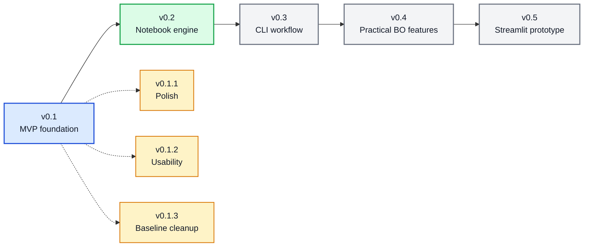

# 🗺️ BO Forge Roadmap

This roadmap is directional, not a release promise. BO Forge should stay useful at each step: a clean backend engine first, then notebook/CLI/app wrappers around it.

## 🧭 Roadmap So Far

Current baseline: `v0.1.3`. Next planned milestone: `v0.2`, focused on a higher-level notebook campaign/session workflow.

### Patch Notes So Far

| Version | Type | Summary |
| --- | --- | --- |
| `v0.1` | Major MVP | Core backend, CSV logs, Sobol, GP, LogEI/qLogEI |
| `v0.1.1` | Patch | README, quickstart, notebook execution support, repo guide |
| `v0.1.2` | Patch | CSV schema docs, common errors, minimisation + qLogEI batch demo |
| `v0.1.3` | Patch | Notebook metadata cleanup, docs links, notebook validation test |

## 📓 v0.1 - Notebook Sequential Campaign Demo

Status: current

- Continuous variables only.
- Single-objective maximize/minimize campaigns.
- YAML config parsing with dataclasses.
- Canonical CSV campaign logs with `row_id`, `iteration`, `status`, and `source`.
- Sequential suggested-to-observed workflow with `mark_observed()`.
- Sobol initial suggestions.
- BoTorch `SingleTaskGP` with LogEI/qLogEI.
- Resume from CSV logs.
- Basic progress and design-space diagnostics.
- Simulated campaign notebook.

## 🧰 v0.2 - Stronger Notebook Engine

- Improve CSV ergonomics for manually edited logs.
- Add clearer notebook cells for common user mistakes and recovery.
- Add richer validation summaries before model fitting.
- Add more diagnostic plots, such as best-by-iteration and pending-vs-observed views.
- Add example campaigns beyond the simple 2D case.
- Add optional figure export paths to the notebook workflow.

## 💻 v0.3 - CLI Workflow

- Add a small CLI wrapper around the backend package.
- Commands:
  - `bo-forge validate`
  - `bo-forge suggest`
  - `bo-forge mark-observed`
  - `bo-forge plot`
- Keep CLI behavior equivalent to the notebook API.
- Preserve the CSV log as the source of truth.

## 🧪 v0.4 - Practical BO Features

- Observation noise support.
- Fixed/context variables.
- Simple constraints.
- Better duplicate and near-duplicate avoidance.
- Candidate diversity rules for batch suggestions.
- Optional objective transforms.
- More explicit model diagnostics.

## 🖥️ v0.5 - Streamlit Prototype

- Build a thin Streamlit wrapper around the backend package.
- Support config upload/editing.
- Show campaign log validation issues.
- Suggest candidates and enter results through the UI.
- Display progress and diagnostic plots.
- Keep BO logic out of the app layer.

## 🔮 Later

- FastAPI backend.
- React frontend.
- Database-backed campaign storage.
- Mixed continuous/categorical variables.
- Multi-objective optimisation.
- Multi-fidelity or contextual BO.
- Authentication and multi-user campaign management.
- Exportable reports for campaign summaries.
