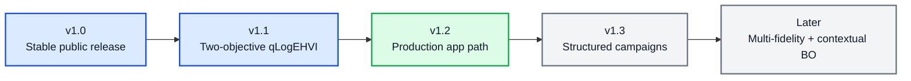

# 🧭 BO Forge Roadmap After v1.0

This roadmap starts after the first stable public release. It is directional, not a release promise. BO Forge should keep the stable YAML/CSV/session/CLI/app foundation while exploring larger workflow and modelling shifts in separate release lines.

## 🧭 Roadmap So Far

Current baseline: `v1.1.0`. The next planned milestone is `v1.2`, focused on separating the local Streamlit prototype from a more production-ready app path.

### Patch Notes So Far

| Version | Type | Summary |
| --- | --- | --- |
| `v1.0.0` | Stable | First stable public release, packaging, public API, and release docs |
| `v1.1.0` | Major | Coupled two-objective qLogEHVI campaigns, Pareto fronts, and hypervolume progress |

## 🧬 v1.1 - Two-Objective qLogEHVI Campaigns

Status: completed

- Exactly two coupled objectives.
- User-facing objective directions and reference points.
- qLogEHVI suggestions with mixed variables and feasibility constraints.
- Strict multi-objective CSV schema.
- Pareto-front reporting in user-facing units.
- Hypervolume progress with `0.0` when no point dominates the reference point.
- Session, CLI, report, notebook, and diagnostic plot support.

Deferred beyond `v1.1.0`:

- 3+ objectives.
- Missing/asynchronous objective values.
- `ModelListGP`.
- Cost, review, and replicate combinations for multi-objective campaigns.
- Full Streamlit multi-objective workflow polish.

## 🏗️ v1.2 - Production App Path

Status: planned

- Clearer separation between local app prototype and deployable service.
- FastAPI or equivalent backend exploration.
- Persistent campaign storage beyond local CSV files.
- Auth and multi-user design only if the deployment path requires it.

## 🧩 v1.3 - Structured Campaigns

Status: planned

- Staged or hierarchical campaign workflows.
- Variables that appear only in specific campaign stages.
- Stage-aware validation, reporting, and diagnostics.

## 🔮 Later

Status: directional

- Multi-fidelity BO.
- Contextual BO.
- More specialised surrogate models or kernels.
- Deeper app collaboration workflows.
