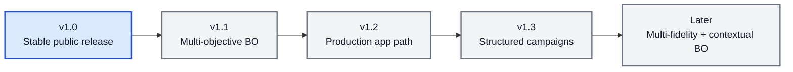

# 🧭 BO Forge Roadmap After v1.0

This roadmap starts after the first stable public release. It is directional, not a release promise.

## 🎯 Direction

After v1.0, BO Forge should keep the stable YAML/CSV/session/CLI/app foundation while exploring larger workflow and modelling shifts in separate release lines.

## 🧬 v1.1 - Multi-Objective BO

Potential scope:

- Pareto-front tracking and reporting.
- Multi-objective CSV schema extensions.
- Multi-objective diagnostics.
- Session, CLI, and app workflows for Pareto-set review.

## 🏗️ v1.2 - Production App Path

Potential scope:

- Clearer separation between local app prototype and deployable service.
- FastAPI or equivalent backend exploration.
- Persistent campaign storage beyond local CSV files.
- Auth and multi-user design only if the deployment path requires it.

## 🧩 v1.3 - Structured Campaigns

Potential scope:

- Staged or hierarchical campaign workflows.
- Variables that appear only in specific campaign stages.
- Stage-aware validation, reporting, and diagnostics.

## 🔮 Later

Potential scope:

- Multi-fidelity BO.
- Contextual BO.
- More specialised surrogate models or kernels.
- Deeper app collaboration workflows.
