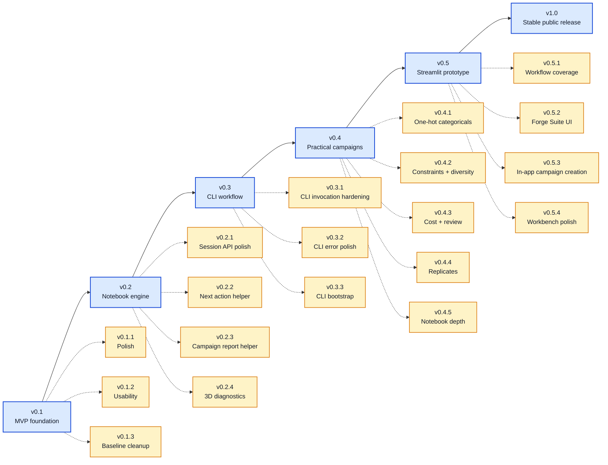

# 🗺️ BO Forge Roadmap

This roadmap is directional, not a release promise. BO Forge should stay useful at each step: a clean backend engine first, then notebook/CLI/app wrappers around it.

## 🧭 Roadmap So Far

Current baseline: `v1.0.0`. Post-1.0 directions have moved to [ROADMAP_AFTER_V1.md](ROADMAP_AFTER_V1.md).

### Patch Notes So Far

| Version | Type | Summary                                                             |
| --- | --- |---------------------------------------------------------------------|
| `v0.1` | Major MVP | Core backend, CSV logs, Sobol, GP, LogEI/qLogEI                     |
| `v0.1.1` | Patch | README, quickstart, notebook execution support, repo guide          |
| `v0.1.2` | Patch | CSV schema docs, common errors, minimisation + qLogEI batch demo    |
| `v0.1.3` | Patch | Notebook metadata cleanup, docs links, notebook validation test     |
| `v0.2.0` | Major | CampaignSession notebook engine                                     |
| `v0.2.1` | Patch | Read-only session API helpers and notebook hygiene guards           |
| `v0.2.2` | Patch | Read-only next-action guidance for notebook campaign loops          |
| `v0.2.3` | Patch | Read-only campaign report helper                                    |
| `v0.2.4` | Patch | 3D example, higher-dimensional diagnostics, and figure export paths |
| `v0.3.0` | Major | CLI workflow around the CampaignSession API                         |
| `v0.3.1` | Patch | CLI invocation hardening with package module entrypoint             |
| `v0.3.2` | Patch | CLI error polish for expected failure paths                         |
| `v0.3.3` | Patch | Add CLI doctor and init-log commands                                |
| `v0.4.0` | Major | Mixed-variable single-objective BO                                  |
| `v0.4.1` | Patch | One-hot categorical encoding and mixed-suggestion quality           |
| `v0.4.2` | Patch | Constraints, duplicate handling, and batch diversity                |
| `v0.4.3` | Patch | Cost-aware ranking and human-review support                         |
| `v0.4.4` | Patch | Explicit replicate tracking and mean-aggregated model fitting       |
| `v0.4.5` | Patch | Notebook depth polish with 15-step simulated campaigns              |
| `v0.5.0` | Major | Local Streamlit campaign app MVP                                    |
| `v0.5.1` | Patch | Streamlit workflow coverage                                         |
| `v0.5.2` | Patch | Forge Suite UI polish and practical panels                          |
| `v0.5.3` | Patch | In-app campaign creation and Streamlit header cleanup                |
| `v0.5.4` | Patch | Final Streamlit workbench polish and v1.0-ready baseline            |
| `v1.0.0` | Stable | First stable public release, packaging, public API, and release docs |

## 📓 v0.1 - Notebook Sequential Campaign Demo

Status: completed

- Continuous variables only.
- Single-objective maximize/minimize campaigns.
- YAML config parsing with dataclasses.
- Canonical CSV campaign logs with `row_id`, `iteration`, `status`, and `source`.
- Sequential suggested-to-observed workflow with `mark_observed()`.
- Sobol initial suggestions.
- BoTorch `SingleTaskGP` with LogEI/qLogEI.
- Resume from CSV logs.
- Basic progress and design-space diagnostics.
- Simulated campaign notebook.

## 🧰 v0.2 - Stronger Notebook Engine

Status: completed

- Add `CampaignSession` as the notebook campaign/session workflow.
- Support one-object session creation from config + log.
- Add session summary, pending suggestions, safe appends, safe observed transitions, reloads, and diagnostic plotting.
- Add read-only `campaign_status()` and `best_observation()` helpers.
- Add read-only `next_action()` guidance for notebook campaign loops.
- Add read-only `report()` and `export_report()` helpers for notebook summaries.
- Add a 3D continuous example and dimension-aware diagnostics.
- Add optional figure export paths to the notebook workflow.
- Keep the lower-level backend API unchanged for explicit, testable workflows.

## 💻 v0.3 - CLI Workflow

Status: completed

- Add a small CLI wrapper around the `CampaignSession` workflow.
- Commands:
  - `bo-forge --version`
  - `bo-forge doctor`
  - `bo-forge init-log`
  - `bo-forge validate`
  - `bo-forge summary`
  - `bo-forge status`
  - `bo-forge next-action`
  - `bo-forge report`
  - `bo-forge suggest`
  - `bo-forge mark-observed`
  - `bo-forge plot`
- Add `python -m bo_forge` as a robust module invocation for notebooks and editable environments.
- Keep CLI behavior equivalent to the notebook API.
- Preserve the CSV log as the source of truth.
- Keep `suggest` non-mutating unless `--append` is passed.

## 🧪 v0.4 - Practical Single-Objective Campaigns

Status: completed

- Mixed-variable campaign configs: `continuous`, `integer`, `discrete`, and `categorical`.
- Strict mixed-variable CSV validation.
- Sobol/random mixed-variable initial suggestions.
- Latent unit-cube encoding/decoding for mixed-variable model fitting.
- One-hot categorical model features while public logs keep category labels.
- Optional feasibility constraints with safe expression validation.
- Encoded-space near-duplicate checks and suggestion quality summaries.
- Optional deterministic cost expressions, budget summaries, and cost-progress plotting.
- Human-review decisions with accepted/rejected/deferred suggestion history.
- Explicit replicate tracking, replicate summaries, and mean-aggregated model fitting.
- Deeper example notebooks ending with 15 completed simulated campaign units.
- Domain repair back to valid user-space rows.
- Single-objective GP + LogEI/qLogEI mixed-variable suggestions.
- Mixed-variable duplicate handling using typed user-space design keys.
- Session, CLI, docs, examples, and notebook coverage.

## 🖥️ v0.5 - Streamlit Prototype

Status: completed

- Build a thin Streamlit wrapper around the backend package.
- Support local YAML config and CSV log path loading.
- Show campaign log validation issues.
- Stage dry-run suggestions before explicit append.
- Export staged suggestions to a standalone CSV without mutating the campaign log.
- Enter results and review decisions through the UI.
- Display and export progress and diagnostic plots.
- Display cost and replicate summaries when configured.
- Align the Streamlit UI with the Forge Suite workbench style.
- Create new local campaign configs and empty canonical CSV logs inside the app.
- Close the local Streamlit prototype line as the practical baseline for v1.0.0 release hardening.
- Keep BO logic out of the app layer.

## 🚀 v1.0 - First Stable Public Release

Status: completed

- Harden package metadata for GitHub and PyPI release readiness.
- Package both `bo_forge` and `bo_forge_app` explicitly.
- Add the `bo-forge-app` console script for launching the packaged Streamlit workbench.
- Add a public API reference, changelog, and release checklist.
- Verify built wheel imports from an installed environment rather than the source checkout.
- Confirm release hygiene, license presence, docs assets, and current install commands.
- Keep BO behavior, CSV schema, CLI commands, notebook workflows, and app semantics unchanged.

## 🔮 After v1.0

Post-1.0 directions live in [ROADMAP_AFTER_V1.md](ROADMAP_AFTER_V1.md).
