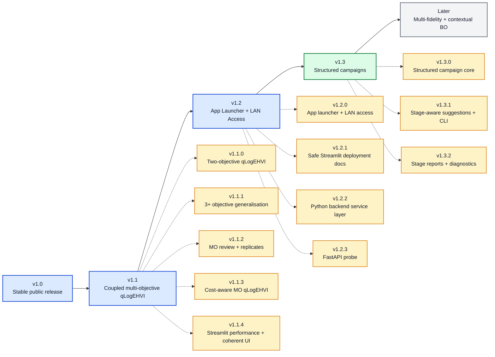

# 🧭 BO Forge Roadmap After v1.0

This roadmap starts after the first stable public release. It is directional, not a release promise. BO Forge should keep the stable YAML/CSV/session/CLI/app foundation while exploring larger workflow and modelling shifts in separate release lines.

## 🧭 Roadmap So Far

Current baseline: `v1.3.2`. The v1.2.x line is complete; v1.3 now has a structured campaign core, explicit stage-aware backend/session/CLI suggestions, and read-only stage reports and diagnostics while keeping automatic stage transitions and deeper structured workflows deferred.

### Patch Notes So Far

| Version | Type | Summary |
| --- | --- | --- |
| `v1.0.0` | Stable | First stable public release, packaging, public API, and release docs |
| `v1.1.0` | Major | Coupled two-objective qLogEHVI campaigns, Pareto fronts, and hypervolume progress |
| `v1.1.1` | Minor | Generalized coupled `m >= 2` objective qLogEHVI campaigns and 3+ objective Pareto diagnostics |
| `v1.1.2` | Minor | Review/replicate support for multi-objective qLogEHVI plus noisy replicate-aware GP fitting and single-objective active repeats |
| `v1.1.3` | Minor | Cost-aware multi-objective qLogEHVI with deterministic batch utility, budget filtering, and cost-progress diagnostics |
| `v1.1.4` | Minor | Final v1.1.x Streamlit performance and coherent UI patch covering all v1.1 backend workflows |
| `v1.2.0` | Minor | Testable `bo-forge-app` launcher, `python -m bo_forge_app`, host/port/browser controls, trusted-LAN warnings, and optional macOS `.command` launcher |
| `v1.2.1` | Patch | Safe Streamlit deployment docs covering local-only, trusted-LAN, SSH/VPN, and externally authenticated reverse-proxy modes |
| `v1.2.2` | Patch | Internal non-HTTP Python service layer for Streamlit-facing campaign workflows |
| `v1.2.3` | Patch | Experimental optional FastAPI probe around `CampaignAppService` for local or trusted-network API exploration |
| `v1.3.0` | Minor | Structured campaign core with stage config, canonical `stage` CSV column, and stage-aware log validation |
| `v1.3.1` | Minor | Explicit stage-aware backend/session/CLI suggestions for structured campaigns |
| `v1.3.2` | Minor | Read-only stage summaries, report sections, CLI inspection, and stage diagnostics for structured campaigns |

## 🧬 v1.1 - Coupled Multi-Objective qLogEHVI Campaigns

Status: completed

- Coupled multi-objective campaigns with `m >= 2` objectives.
- Primary tested range is `2 <= m <= 4`; larger objective counts are advanced usage.
- User-facing objective directions and reference points.
- qLogEHVI suggestions with mixed variables and feasibility constraints.
- Strict dynamic multi-objective CSV schema.
- Pareto-front reporting in user-facing units.
- Pairwise Pareto projections for 3+ objective campaigns using one full-space Pareto set.
- Pareto parallel-coordinate plots for 3+ objective campaigns.
- Hypervolume progress with `0.0` when no point dominates the reference point.
- Session, CLI, report, notebook, and diagnostic plot support.
- Review and replicate metadata for coupled multi-objective campaigns.
- Noisy replicate-aware GP fitting with replicate-derived observation variance.
- Single-objective active repeat suggestions through the `uncertain_best` replicate policy.
- Cost-aware multi-objective qLogEHVI using deterministic batch utility.
- Streamlit workflow completion for v1.1 backend capabilities, including coupled multi-objective observation entry and lazy report/plot rendering.

## 🏗️ v1.2 - App Launcher And Access Path

Status: completed

- Testable `bo-forge-app` launcher with explicit host, port, and browser flags.
- `python -m bo_forge_app` module launch.
- Trusted-LAN startup guidance without adding authentication or deployment infrastructure.
- Optional macOS double-click `.command` launcher.
- Safe Streamlit deployment docs.
- Python backend service layer for local app workflows.
- Experimental optional FastAPI probe around the app service layer.
- Clearer separation between local app prototype and deployable service.
- Production auth, database, multi-user app state, and deeper collaboration workflows remain outside v1.2.

## 🧩 v1.3 - Structured Campaigns

Status: active

- Optional `stages:` config block with named stages.
- Variables that appear only in specific campaign stages.
- Canonical `stage` CSV column for structured campaign logs.
- Stage-aware row validation with inactive variables required blank.
- Minimal session-summary reporting for configured stages.
- Explicit stage-aware backend/session/CLI suggestions for a selected stage.
- Generated structured suggestions populate `stage`, fill only active variables, and keep inactive variables blank.
- Read-only stage summaries, structured report sections, CLI stage inspection, and stage diagnostics.
- Automatic stage transitions, cost-aware structured campaigns, Streamlit structured workflows, and multi-fidelity semantics remain deferred.

## 🔮 Later

Status: directional

- Multi-fidelity BO.
- Contextual BO.
- More specialised surrogate models or kernels.
- Deeper app collaboration workflows.
