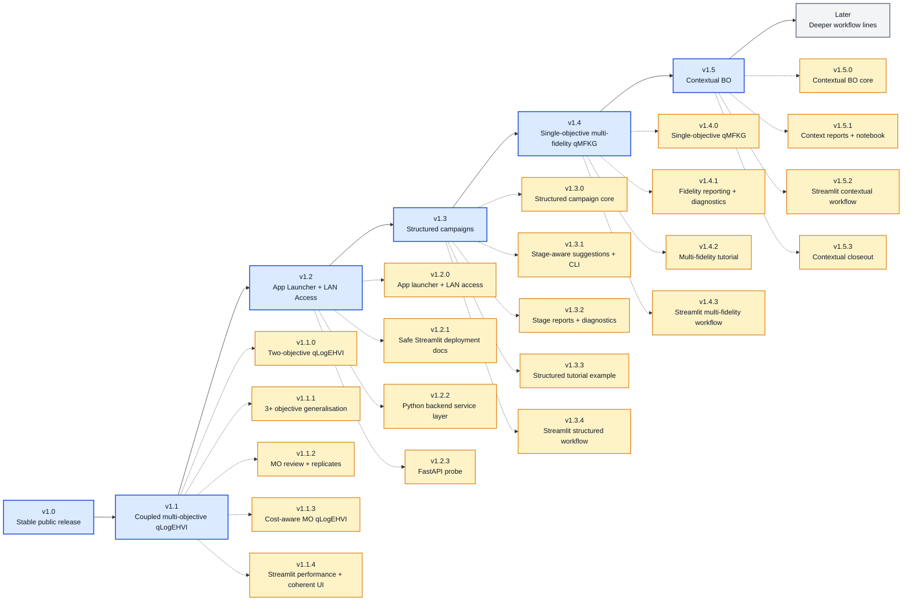

# 🧭 BO Forge Roadmap After v1.0

This roadmap starts after the first stable public release. It is directional, not a release promise. BO Forge should keep the stable YAML/CSV/session/CLI/app foundation while exploring larger workflow and modelling shifts in separate release lines.

## 🧭 Roadmap So Far

Current baseline: `v1.5.3`. The v1.5.x line is complete with the conservative single-objective contextual LogEI/qLogEI core, read-only contextual summaries, diagnostics, a notebook, Streamlit contextual campaign creation, and final context-state safety polish. Context variables remain normal CSV variables but are fixed at suggestion time. Contextual multi-objective, structured, multi-fidelity, cost-aware, and replicate-aware workflows remain deferred to a later minor line.

### Patch Notes So Far

| Version | Type | Summary |
| --- | --- | --- |
| `v1.0.0` | Stable | First stable public release, packaging, public API, and release docs |
| `v1.1.0` | Major | Coupled two-objective qLogEHVI campaigns, Pareto fronts, and hypervolume progress |
| `v1.1.1` | Minor | Generalized coupled `m >= 2` objective qLogEHVI campaigns and 3+ objective Pareto diagnostics |
| `v1.1.2` | Minor | Review/replicate support for multi-objective qLogEHVI plus noisy replicate-aware GP fitting and single-objective active repeats |
| `v1.1.3` | Minor | Cost-aware multi-objective qLogEHVI with deterministic batch utility, budget filtering, and cost-progress diagnostics |
| `v1.1.4` | Minor | Final v1.1.x Streamlit performance and coherent UI patch covering all v1.1 backend workflows |
| `v1.2.0` | Minor | Testable `bo-forge-app` launcher, `python -m bo_forge_app`, host/port/browser controls, trusted-LAN warnings, and optional macOS `.command` launcher |
| `v1.2.1` | Patch | Safe Streamlit deployment docs covering local-only, trusted-LAN, SSH/VPN, and externally authenticated reverse-proxy modes |
| `v1.2.2` | Patch | Internal non-HTTP Python service layer for Streamlit-facing campaign workflows |
| `v1.2.3` | Patch | Experimental optional FastAPI probe around `CampaignAppService` for local or trusted-network API exploration |
| `v1.3.0` | Minor | Structured campaign core with stage config, canonical `stage` CSV column, and stage-aware log validation |
| `v1.3.1` | Minor | Explicit stage-aware backend/session/CLI suggestions for structured campaigns |
| `v1.3.2` | Minor | Read-only stage summaries, report sections, CLI inspection, and stage diagnostics for structured campaigns |
| `v1.3.3` | Patch | Structured campaign tutorial config, seed log, and notebook for staged screening/refinement workflows |
| `v1.3.4` | Patch | Streamlit structured campaign workflow wrapper with stage selector, stage summaries, and stage diagnostics |
| `v1.4.0` | Minor | Single-objective continuous-fidelity qMFKG with unchanged CSV schema |
| `v1.4.1` | Patch | Read-only fidelity summaries, CLI inspection, reports, Streamlit routing, and fidelity diagnostics |
| `v1.4.2` | Patch | Multi-fidelity qMFKG tutorial notebook and release-readiness documentation |
| `v1.4.3` | Patch | Streamlit creation and qMFKG suggestion controls for single-objective continuous-fidelity campaigns |
| `v1.5.0` | Minor | Contextual single-objective LogEI/qLogEI core with fixed context variables |
| `v1.5.1` | Patch | Context summaries, context diagnostics, CLI inspection, reports, and contextual tutorial notebook |
| `v1.5.2` | Patch | Streamlit creation and suggestion controls for single-objective contextual LogEI campaigns |
| `v1.5.3` | Patch | Streamlit creation and suggestion controls closeout with context-state safety and release polish |

## 🧬 v1.1 - Coupled Multi-Objective qLogEHVI Campaigns

Status: completed

- Coupled multi-objective campaigns with `m >= 2` objectives.
- Primary tested range is `2 <= m <= 4`; larger objective counts are advanced usage.
- User-facing objective directions and reference points.
- qLogEHVI suggestions with mixed variables and feasibility constraints.
- Strict dynamic multi-objective CSV schema.
- Pareto-front reporting in user-facing units.
- Pairwise Pareto projections for 3+ objective campaigns using one full-space Pareto set.
- Pareto parallel-coordinate plots for 3+ objective campaigns.
- Hypervolume progress with `0.0` when no point dominates the reference point.
- Session, CLI, report, notebook, and diagnostic plot support.
- Review and replicate metadata for coupled multi-objective campaigns.
- Noisy replicate-aware GP fitting with replicate-derived observation variance.
- Single-objective active repeat suggestions through the `uncertain_best` replicate policy.
- Cost-aware multi-objective qLogEHVI using deterministic batch utility.
- Streamlit workflow completion for v1.1 backend capabilities, including coupled multi-objective observation entry and lazy report/plot rendering.

## 🏗️ v1.2 - App Launcher And Access Path

Status: completed

- Testable `bo-forge-app` launcher with explicit host, port, and browser flags.
- `python -m bo_forge_app` module launch.
- Trusted-LAN startup guidance without adding authentication or deployment infrastructure.
- Optional macOS double-click `.command` launcher.
- Safe Streamlit deployment docs.
- Python backend service layer for local app workflows.
- Experimental optional FastAPI probe around the app service layer.
- Clearer separation between local app prototype and deployable service.
- Production auth, database, multi-user app state, and deeper collaboration workflows remain outside v1.2.

## 🧩 v1.3 - Structured Campaigns

Status: completed

- Optional `stages:` config block with named stages.
- Variables that appear only in specific campaign stages.
- Canonical `stage` CSV column for structured campaign logs.
- Stage-aware row validation with inactive variables required blank.
- Minimal session-summary reporting for configured stages.
- Explicit stage-aware backend/session/CLI suggestions for a selected stage.
- Generated structured suggestions populate `stage`, fill only active variables, and keep inactive variables blank.
- Read-only stage summaries, structured report sections, CLI stage inspection, and stage diagnostics.
- Structured screening/refinement tutorial config, seed log, and output-free notebook.
- Streamlit stage display, stage-aware dry-run suggestions, stage summaries, and stage diagnostics.
- Automatic stage transitions, cost-aware structured campaigns, structured campaign creation in Streamlit, and combinations with multi-fidelity workflows remain deferred.

## 🧪 v1.4 - Single-Objective Multi-Fidelity qMFKG

Status: completed

- Optional `fidelity:` config section for one continuous fidelity variable.
- `bo.acquisition: qmf_kg` for single-objective multi-fidelity campaigns.
- BoTorch `SingleTaskMultiFidelityGP` fitting.
- BoTorch `qMultiFidelityKnowledgeGradient` with one-shot KG initial
  conditions, affine fidelity cost, inverse-cost utility, target-fidelity
  projection, and target-fidelity posterior-mean current value.
- No new CSV columns; the fidelity variable remains a normal user-facing
  variable column.
- Initial Sobol/random suggestions remain unchanged; model-based suggestions
  use `source=qmf_kg`.
- Read-only `fidelity_summary`, `bo-forge fidelity-summary`, campaign report
  sections, Streamlit routing, and fidelity diagnostics are available.
- `notebooks/15_multi_fidelity_qmfkg_campaign.ipynb` demonstrates the
  sequential qMFKG workflow using the existing example config and seed log.
- Streamlit can create single-objective continuous-fidelity qMFKG campaigns
  with editable YAML preview and qMFKG batch size capped at one.
- Multi-objective, structured, cost-aware, replicate-aware, batch, and
  discrete/categorical multi-fidelity workflows remain deferred.

## 🌐 v1.5 - Contextual BO

Status: completed

- Optional `context:` config section with context variable names and defaults.
- Context variables remain normal CSV variable columns; no new CSV columns are
  added.
- Single-objective contextual LogEI/qLogEI suggestions fix context variables at
  suggestion time and optimize only non-context decision variables.
- Context variables may be continuous, integer, discrete, or categorical.
- `CampaignSession.suggest_next(..., context_values={...})` and
  `bo-forge suggest --context NAME=VALUE` are available.
- `context_summary()`, `CampaignSession.context_summary()`,
  `bo-forge context-summary`, and `bo-forge plot --kind context-diagnostics`
  provide read-only contextual inspection.
- `notebooks/16_contextual_logei_campaign.ipynb` demonstrates a lightweight
  sequential contextual workflow.
- Streamlit can create single-objective Contextual LogEI campaigns with
  selected context variables and optional defaults.
- Loaded contextual campaigns collect context values in the `Suggest` panel and
  protect staged suggestions against context changes before append.
- Streamlit context defaults and per-run suggestion contexts are distinctly
  labelled and scoped by loaded campaign identity to avoid stale context reuse.
- The v1.5.x line closes with contextual core support, reports, diagnostics,
  tutorial notebook, and Streamlit creation/suggestion workflow.
- Contextual multi-objective, structured, multi-fidelity, cost-aware, and
  replicate-aware workflows remain deferred.

## 🔮 Later

Status: directional

- More specialised surrogate models or kernels.
- Deeper app collaboration workflows.
