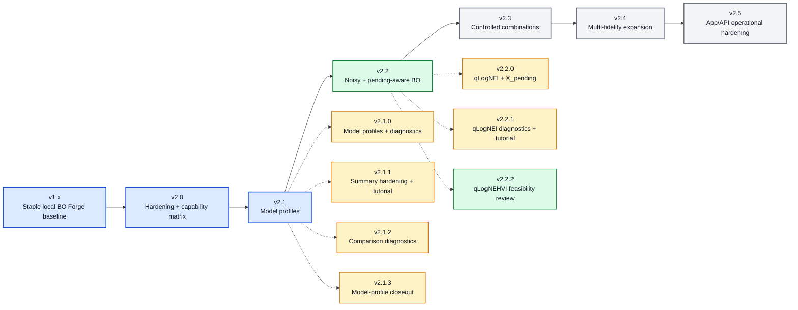

# BO Forge v2.x Roadmap

This roadmap begins with the v2.0.0 hardening baseline. It is directional, not
a release promise. BO Forge v2.x should be a line of coherence and controlled expansion,
not a rewrite of the CSV-backed campaign model.

Current baseline: `v2.2.2`. The v2.2.2 release keeps the v2.2 noisy and
pending-aware BO line focused on conservative single-objective qLogNEI support
while documenting qLogNEHVI feasibility and keeping noisy multi-objective BO
explicitly deferred. The next v2.2 patch should either implement conservative
qLogNEHVI within the reviewed scope or close v2.2 with qLogNEHVI deferred.

## Roadmap So Far

## v2.0.x - Stable v2 Baseline

Status: completed

- Preserve v1 YAML, CSV, session, CLI, notebook, Streamlit, service, and
  experimental API probe behavior.
- Add [docs/CAPABILITY_MATRIX.md](docs/CAPABILITY_MATRIX.md) as the supported
  and deferred combination reference.
- Harden package and release tests for wheel/sdist boundaries.
- Keep the FastAPI probe experimental, optional, root-bound, and unauthenticated.
- Keep production auth, database storage, and public internet deployment out of
  scope.

## v2.1.x - Model Profiles And Advanced Surrogates

Status: completed

- `v2.1.0` introduces curated model profiles instead of raw BoTorch kernel
  passthrough.
- `v2.1.1` hardens process-local `last_fit_*` summary metadata and adds the
  model-profile tutorial notebook.
- `v2.1.2` adds read-only model-profile comparison diagnostics through
  `model_profile_comparison`, `bo-forge model-compare`, and
  `plot --kind model-comparison`.
- `v2.1.3` closes the model-profile line with comparison hardening, Streamlit
  laziness checks, roadmap closeout, and release-readiness polish.
- Supports `default`, `smooth`, `rough`, and `robust` profiles for
  single-objective LogEI/qLogEI campaigns.
- Adds `model_summary`, `bo-forge model-summary`, and
  `plot --kind model-diagnostics`.
- Model comparison is diagnostic only; BO Forge does not automatically select
  or change the configured profile.
- Keeps non-default profiles rejected for multi-objective, multi-fidelity, and
  structured campaigns in v2.1.x.
- Preserves CSV schema compatibility.

## v2.2.x - Noisy And Pending-Aware BO

Status: active

- `v2.2.0` adds `bo.acquisition: qlog_nei` for supported single-objective
  workflows and passes accepted pending suggestions as BoTorch `X_pending`.
- `v2.2.1` adds `qlog_nei_summary`, `bo-forge qlog-nei-summary`,
  `plot --kind qlog-nei-diagnostics`, a qLogNEI tutorial notebook, and
  Streamlit workflow polish.
- `v2.2.2` adds [docs/QLOGNEHVI_FEASIBILITY.md](docs/QLOGNEHVI_FEASIBILITY.md)
  and keeps `bo.acquisition: qlog_nehvi` plus `source=qlog_nehvi` unsupported
  while noisy multi-objective semantics are reviewed.
- `v2.2.3` is either conservative qLogNEHVI implementation within the reviewed
  scope or v2.2 closeout with qLogNEHVI explicitly deferred.
- Keep learned-noise and replicate-derived variance semantics clear.
- Avoid adding noisy multi-objective scope before the data-safety model is
  explicit.

## v2.3.x - Controlled Feature Combinations

Status: planned

- Add selected combinations deliberately rather than enabling an unrestricted
  feature cross-product.
- Candidate combinations include contextual + review, contextual + cost,
  contextual + replicates, and structured + cost.
- Keep unsupported combinations documented in the capability matrix.

## v2.4.x - Multi-Fidelity Expansion

Status: planned

- Explore discrete fidelity levels.
- Expand fidelity diagnostics.
- Revisit stage/fidelity and context/fidelity interactions only after the
  conservative qMFKG baseline remains stable.

## v2.5.x - App/API Operational Hardening

Status: planned

- Consider server-side staged API state.
- Consider signed staged bundles.
- Improve safeguards around concurrent writes.
- Keep any production app/API direction explicit about auth, persistence, and
  deployment boundaries.

## Not Yet

- No mandatory database.
- No full authentication system.
- No SaaS/team workflows.
- No unrestricted feature cross-product.
- No raw low-level kernel API as the first modeling extension.
- No replacement of CSV logs as the source of truth.
