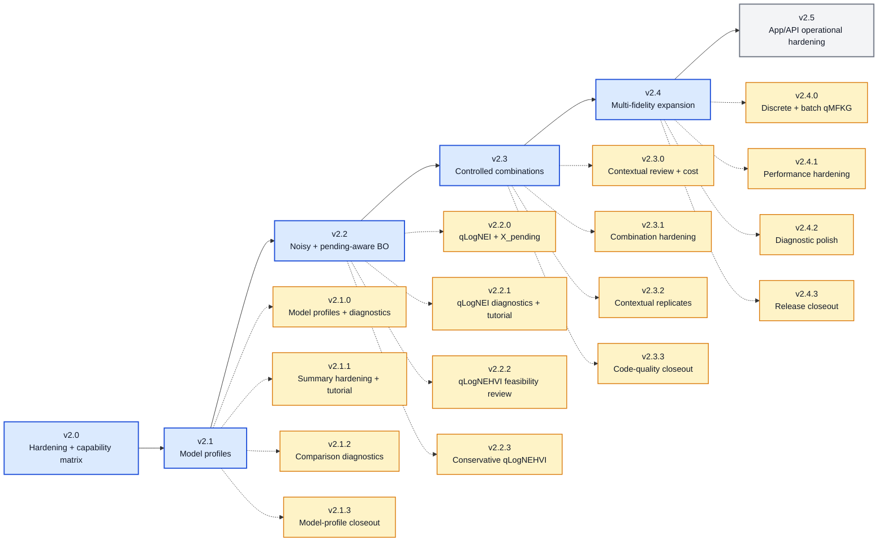

# BO Forge v2.x Roadmap

This roadmap begins with the v2.0.0 hardening baseline. It is directional, not
a release promise. BO Forge v2.x should be a line of coherence and controlled expansion,
not a rewrite of the CSV-backed campaign model.

Current baseline: `v2.4.3`. The v2.4.3 release closes the v2.4.x line with
regression hardening, tutorial alignment, documentation cleanup, and package
verification while preserving qMFKG numerical behavior and schemas. Broader
fidelity combinations remain deferred.

## Roadmap So Far

```mermaid
flowchart LR
    v20["v2.0<br/>Hardening + capability matrix"] --> v21["v2.1<br/>Model profiles"] --> v22["v2.2<br/>Noisy + pending-aware BO"] --> v23["v2.3<br/>Controlled combinations"] --> v24["v2.4<br/>Multi-fidelity expansion"] --> v25["v2.5<br/>App/API operational hardening"]

    v210["v2.1.0<br/>Model profiles + diagnostics"]
    v211["v2.1.1<br/>Summary hardening + tutorial"]
    v212["v2.1.2<br/>Comparison diagnostics"]
    v213["v2.1.3<br/>Model-profile closeout"]
    v220["v2.2.0<br/>qLogNEI + X_pending"]
    v221["v2.2.1<br/>qLogNEI diagnostics + tutorial"]
    v222["v2.2.2<br/>qLogNEHVI feasibility review"]
    v223["v2.2.3<br/>Conservative qLogNEHVI"]
    v230["v2.3.0<br/>Contextual review + cost"]
    v231["v2.3.1<br/>Combination hardening"]
    v232["v2.3.2<br/>Contextual replicates"]
    v233["v2.3.3<br/>Code-quality closeout"]
    v240["v2.4.0<br/>Discrete + batch qMFKG"]
    v241["v2.4.1<br/>Performance hardening"]
    v242["v2.4.2<br/>Diagnostic polish"]
    v243["v2.4.3<br/>Release closeout"]

    v21 -.-> v210
    v21 -.-> v211
    v21 -.-> v212
    v21 -.-> v213
    v22 -.-> v220
    v22 -.-> v221
    v22 -.-> v222
    v22 -.-> v223
    v23 -.-> v230
    v23 -.-> v231
    v23 -.-> v232
    v23 -.-> v233
    v24 -.-> v240
    v24 -.-> v241
    v24 -.-> v242
    v24 -.-> v243

    class v20,v21,v22,v23,v24 majorDone
    class v25 majorFuture
    class v210,v211,v212,v213 patchDone
    class v220,v221,v222,v223 patchDone
    class v230,v231,v232,v233 patchDone
    class v240,v241,v242,v243 patchDone

    classDef majorDone fill:#dbeafe,stroke:#1d4ed8,stroke-width:2px,color:#111827;
    classDef majorFuture fill:#f3f4f6,stroke:#6b7280,stroke-width:2px,color:#111827;
    classDef patchDone fill:#fef3c7,stroke:#d97706,stroke-width:1.5px,color:#111827;
```

## v2.0.x - Stable v2 Baseline

Status: completed

- Preserve v1 YAML, CSV, session, CLI, notebook, Streamlit, service, and
  experimental API probe behavior.
- Add [docs/CAPABILITY_MATRIX.md](docs/CAPABILITY_MATRIX.md) as the supported
  and deferred combination reference.
- Harden package and release tests for wheel/sdist boundaries.
- Keep the FastAPI probe experimental, optional, root-bound, and unauthenticated.
- Keep production auth, database storage, and public internet deployment out of
  scope.

## v2.1.x - Model Profiles And Advanced Surrogates

Status: completed

- `v2.1.0` introduces curated model profiles instead of raw BoTorch kernel
  passthrough.
- `v2.1.1` hardens process-local `last_fit_*` summary metadata and adds the
  model-profile tutorial notebook.
- `v2.1.2` adds read-only model-profile comparison diagnostics through
  `model_profile_comparison`, `bo-forge model-compare`, and
  `plot --kind model-comparison`.
- `v2.1.3` closes the model-profile line with comparison hardening, Streamlit
  laziness checks, roadmap closeout, and release-readiness polish.
- Supports `default`, `smooth`, `rough`, and `robust` profiles for
  single-objective LogEI/qLogEI campaigns.
- Adds `model_summary`, `bo-forge model-summary`, and
  `plot --kind model-diagnostics`.
- Model comparison is diagnostic only; BO Forge does not automatically select
  or change the configured profile.
- Keeps non-default profiles rejected for multi-objective, multi-fidelity, and
  structured campaigns in v2.1.x.
- Preserves CSV schema compatibility.

## v2.2.x - Noisy And Pending-Aware BO

Status: completed

- `v2.2.0` adds `bo.acquisition: qlog_nei` for supported single-objective
  workflows and passes accepted pending suggestions as BoTorch `X_pending`.
- `v2.2.1` adds `qlog_nei_summary`, `bo-forge qlog-nei-summary`,
  `plot --kind qlog-nei-diagnostics`, a qLogNEI tutorial notebook, and
  Streamlit workflow polish.
- `v2.2.2` adds [docs/QLOGNEHVI_FEASIBILITY.md](docs/QLOGNEHVI_FEASIBILITY.md)
  and locks down the safe qLogNEHVI scope before public exposure.
- `v2.2.3` implements conservative coupled multi-objective qLogNEHVI with
  `X_baseline`, `X_pending`, and review-aware pending semantics.
- Keep learned-noise and replicate-derived variance semantics clear.
- Keep cost-aware, replicate-aware, structured, contextual, multi-fidelity,
  decoupled, and asynchronous qLogNEHVI deferred.

## v2.3.x - Controlled Feature Combinations

Status: completed

- Add selected combinations deliberately rather than enabling an unrestricted
  feature cross-product.
- `v2.3.0` adds single-objective contextual LogEI support for review metadata,
  deterministic cost, and review + cost together.
- `v2.3.1` hardens contextual combination staging, no-mutation guarantees,
  Streamlit campaign state isolation, and release-readiness coverage.
- `v2.3.2` adds contextual replicate-aware group-mean fitting and restricts
  active repeats to groups matching the requested context.
- `v2.3.3` closes the line with behavior-preserving core/app decomposition,
  capability-based runtime errors, scientific numerical documentation, and an
  enforced production complexity limit.
- Candidate future combinations include structured + cost.
- Keep unsupported combinations documented in the capability matrix.

## v2.4.x - Multi-Fidelity Expansion

Status: completed

- `v2.4.0` adds ordered numeric fidelity levels and qMFKG batches from one through four,
  plus exact-level diagnostics, Streamlit creation controls, and example 22.
- `v2.4.1` adds opt-in optimizer iteration/timeout controls and lazy startup
  boundaries without changing the default qMFKG numerical path.
- `v2.4.2` adds read-only fidelity coverage tables and target-fidelity progress
  plots across Python, CLI, reports, Streamlit, service, and API summary views.
- `v2.4.2` adds no fidelity schema keys and tightens rejection of numerically
  ambiguous ordered levels so each row belongs to at most one level.
- `v2.4.3` closes the line with behavior-freeze coverage, tutorial alignment,
  documentation cleanup, and final package verification without changing BO
  capability or schemas.
- Preserve continuous-fidelity YAML and CSV compatibility.
- Keep named fidelity sources, per-level costs, and batches above four deferred.
- Revisit stage/fidelity and context/fidelity interactions only after the
  conservative qMFKG baseline remains stable.

## v2.5.x - App/API Operational Hardening

Status: planned

- Consider server-side staged API state.
- Consider signed staged bundles.
- Improve safeguards around concurrent writes.
- Keep any production app/API direction explicit about auth, persistence, and
  deployment boundaries.

## Not Yet

- No mandatory database.
- No full authentication system.
- No SaaS/team workflows.
- No unrestricted feature cross-product.
- No raw low-level kernel API as the first modeling extension.
- No replacement of CSV logs as the source of truth.
