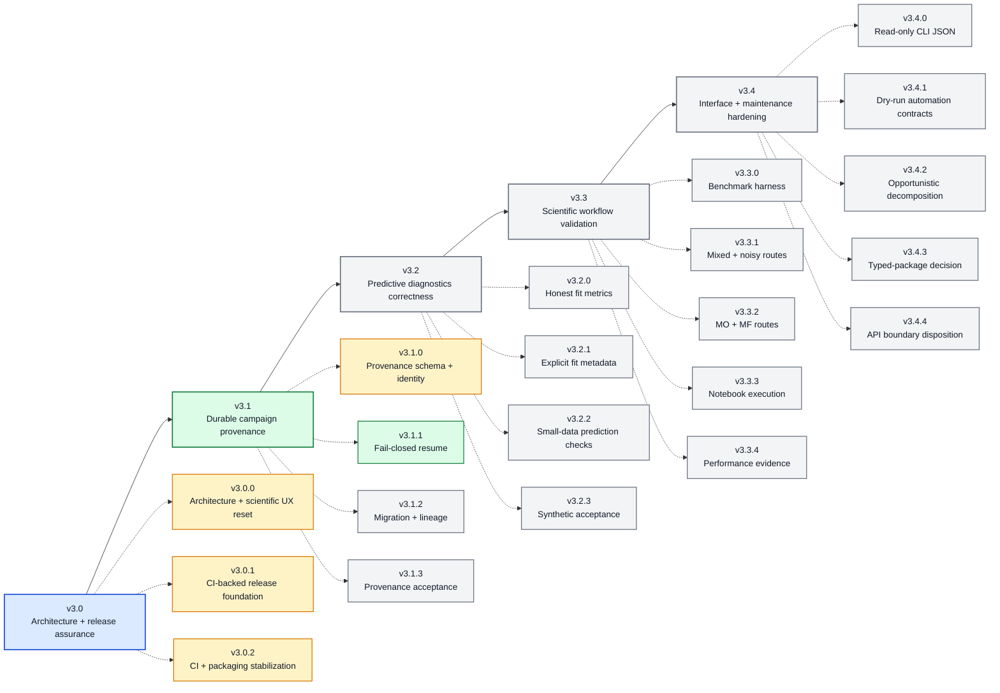

# BO Forge v3.x Roadmap

This roadmap is directional, not a release promise. The v3.x train focuses on
assurance, reproducibility, scientific validation, and maintainability around
the local YAML/CSV campaign model rather than primarily expanding features.

Current prepared baseline: `v3.1.1`. It adds fail-closed resume policy, stable
provenance mismatch classification, and explicit interrupted-transaction
recovery while keeping legacy YAML/CSV campaigns compatible by default.

## Roadmap So Far

### Patch Plan

| Version | Status | Summary |
| --- | --- | --- |
| `v3.0.0` | implemented | Architecture and scientific-UX reset with compatibility facades |
| `v3.0.1` | prepared | Reproducible environments, required CI, tag gate, and release-process hardening |
| `v3.0.2` | prepared | Canonical API factory probes and independent package-extra validation |
| `v3.1.0` | prepared | Versioned campaign manifests, mutation ledger, and managed transaction recovery |
| `v3.1.1` | prepared | Fail-closed resume policy, mismatch classification, and explicit recovery |
| `v3.1.x` | active | Durable campaign provenance and lineage |
| `v3.2.x` | planned | Predictive diagnostics correctness and explicit fit metadata |
| `v3.3.x` | planned | Closed-loop scientific and executable-workflow validation |
| `v3.4.x` | planned | Structured automation interfaces and maintenance decisions |

## v3.0.x - Architecture And Release Assurance

Status: completed

### v3.0.0 - Architecture And Scientific UX Reset

Status: implemented

- Preserve documented top-level APIs, YAML/CSV formats, numerical routing, and
  local workflow semantics.
- Separate configuration, campaign, optimization, diagnostics, application,
  Streamlit, and optional API ownership behind compatibility entrypoints.
- Replace the five-panel workbench with `Campaign`, `Run`, and `Analyze`.
- Standardize scoped scientific figure styling and semantic colors.
- Add architecture, complexity, import-boundary, public-signature, and UI
  behavior-freeze tests.
- Document compatibility facades, navigation mapping, API isolation, and visual
  changes in `docs/MIGRATION_V3.md`.

### v3.0.1 - CI-Backed Release Foundation

Status: prepared; publication requires separate authorization and exact-commit CI

Audit mapping: `REL-001`, `REP-002`, `DOC-001`, `DOC-002`, `DX-001`.

- Generate hashed, fully resolved Python 3.11/3.12 constraints with a pinned
  resolver and explicit Linux/macOS platform targets.
- Require Linux Python 3.11 and 3.12 full-suite CI.
- Add economical macOS 3.12 coverage for canonical/symlink paths, file locks,
  stale fingerprints, atomic replacement, rollback, mode preservation, and
  thread/process mutation paths.
- Run Ruff, syntax/metadata checks, and the complete existing pytest suite.
- Build wheel and sdist through PEP 517 in runner-temporary storage and verify
  both with Twine and package-boundary contracts.
- Install wheel and sdist outside the checkout under the selected constraints,
  run `pip check`, and prove imports resolve from installed artifacts.
- Smoke packaged `bo-forge`, `bo-forge-app`, and `bo-forge-api` entrypoints
  without starting unbounded servers or exposing non-loopback listeners.
- Run representative real BoTorch qMFKG paths in a separate CPU-only bounded
  job rather than in every fast validation job.
- Add a future `v*` tag gate that verifies tag/version identity, builds from the
  exact tagged commit, and retains private workflow artifacts without creating
  a release or publishing to a registry.
- Remove author-home paths from release-facing docs and notebooks and enforce a
  precise regression scan.
- Add `CONTRIBUTING.md` and `SECURITY.md`.
- Make production API/database limitation wording version-neutral.
- Change package maturity metadata to Beta and align authoritative version
  sources at `3.0.1` only after the foundation passes local validation.
- Keep branch/tag protection as a separately configured GitHub repository
  setting; repository workflow files do not prove server-side protection.
- Do not tag, publish, upload public release assets, or write the final release
  announcement as part of this milestone implementation.

Acceptance criteria:

- [ ] All generated constraints pass structural/freshness checks.
- [ ] Required Linux, macOS, package, entrypoint, and numerical CI jobs are
  represented in repository workflows with least-privilege permissions and
  bounded timeouts.
- [ ] Clean Python 3.12 local preflight passes; Python 3.11 remains a required
  CI result rather than an unverified local claim when unavailable.
- [ ] Wheel/sdist metadata, contents, and external installs pass.
- [ ] Release-facing files contain no private author-home paths.
- [ ] Version, maturity classifier, changelog, roadmap, docs, and artifact names
  agree on the prepared release identity.
- [ ] No tag, GitHub Release, package publication, or push occurs.

### v3.0.2 - CI And Packaging Stabilization

Status: prepared; publication requires separate authorization and exact-commit CI

- Standardize installed-artifact validation on the existing
  `bo_forge_api.api:create_app` factory without expanding the package-root API.
- Apply the canonical factory smoke to required CI and the future exact-tag
  validation workflow.
- Test core wheel, Streamlit app-extra, FastAPI extra, and source-distribution
  installations independently outside the source checkout.
- Derive release identity and artifact names from project metadata where
  practical and keep release-assurance tests version-neutral.
- Preserve dependency constraints unless a reproducible resolver or platform
  failure proves a pin invalid.
- Add no scientific feature, campaign combination, schema, endpoint, CLI, UI,
  or public API expansion.
- Mark v3.0.x complete only after every required CI job passes on the exact
  v3.0.2 commit.
- No tag, GitHub Release, package publication, or push occurs as part of local
  preparation.

## v3.1.x - Durable Campaign Provenance

Status: active

Audit mapping: `REP-001`.

### v3.1.0 - Provenance Schema And Campaign Identity

Status: prepared; publication requires separate authorization and exact-commit CI

- Adds a versioned sidecar manifest without replacing YAML/CSV source data.
- Records exact config bytes/hash, normalized semantic config identity, current
  log hash/row count, optimization identity, and bounded environment snapshots.
- Records append-only initialization and mutation events with ordered row IDs,
  environment identity, and previous/resulting log hashes.
- Coordinates managed CSV/manifest writes under the existing canonical log
  lock with rollback and deterministic pending-transaction recovery.
- Verifies present manifests against current config and log identity during load and
  resume, with read-only mismatch diagnostics and fail-closed managed sessions.
- Exposes opt-in initialization and read-only provenance through Python, CLI,
  reports, Streamlit, the application service, and the experimental API.
- Leaves existing campaigns manifest-free and behavior-compatible; explicit
  adoption remains reserved for v3.1.2.
- Adds no BO algorithm, YAML key, CSV column, campaign combination, notebook,
  authentication mechanism, or tamper-proof audit claim.

### v3.1.1 - Fail-Closed Resume Semantics

Status: prepared; publication requires separate authorization and exact-commit CI

- Adds `compatible` and `required` loading policies without changing the legacy
  default or allowing present manifests to be ignored.
- Classifies byte-only config edits, semantic config changes, log identity and
  row-count changes, path mismatches, and pending transaction states with stable
  reason codes and recovery actions.
- Reports current environment drift as non-blocking diagnostic information.
- Replaces implicit next-write transaction repair with explicit, lock-protected
  `recover_provenance()` and `bo-forge provenance-recover` workflows.
- Propagates strict loading and explicit recovery through the application
  service, Streamlit, CLI, and root-bounded experimental API.
- Preserves schema-v1 manifests, legacy reports, BO behavior, YAML/CSV schemas,
  and established mutation atomicity.

### v3.1.2 - Explicit Migration And Lineage

- Add explicit legacy campaign adoption without fabricating unknown history.
- Preserve parent/child identity and old/new manifests.
- Record migrations and authorized overrides append-only.

### v3.1.3 - Provenance Acceptance And Documentation

- Complete compatibility, mutation, concurrency, and migration tests.
- Document adoption, mismatch recovery, lineage, and limitations.
- Require clean artifact and legacy-campaign acceptance before release.

## v3.2.x - Predictive Diagnostics Correctness

Status: planned

### v3.2.0 - Honest In-Sample Metric Labelling

- Rename or explicitly label training RMSE/MAE as in-sample diagnostics.
- Prevent CLI, app, plot, and documentation wording from implying predictive
  model ranking.
- Preserve compatible facades where practical.

### v3.2.1 - Explicit Fit Result And Metadata Ownership

Audit mapping: `ARC-001`.

- Replace process-global mutable `last_fit_*` metadata with an explicit fit
  result/diagnostics object or equivalent owned state.
- Add interleaved and concurrent-fit tests.
- Preserve suggestion numerics and documented summaries during migration.

### v3.2.2 - Small-Data Predictive Diagnostics

- Add carefully bounded LOO and/or cross-validation where statistically useful.
- Report standardized residuals, predictive log-density where appropriate,
  interval coverage, and calibration behavior.
- State small-sample limits and avoid automatic profile selection claims.

### v3.2.3 - Synthetic Acceptance And Interpretation Contract

Audit mapping: diagnostics portion of `SCI-001`.

- Add calibrated and intentionally miscalibrated synthetic fixtures.
- Document valid and invalid metric interpretations.
- Require evidence before any automatic model-selection recommendation.

## v3.3.x - Closed-Loop Scientific And Workflow Validation

Status: planned

Audit mapping: closed-loop portion of `SCI-001`, plus `TST-001` and `PERF-001`.

### v3.3.0 - Benchmark Harness Foundation

- Add versioned benchmark configuration and fixed repeated seed sets.
- Cover continuous single-objective campaigns against random and Sobol
  baselines.
- Report regret, failures, runtime, and distributions rather than exact
  stochastic trajectories.

### v3.3.1 - Mixed, Constrained, And Noisy Routes

- Extend repeated-seed evidence to mixed variables, constraints, and
  noisy/pending behavior.
- Report feasibility, failures, and runtime without weakening assertions.

### v3.3.2 - Multi-Objective And Multi-Fidelity Routes

- Add hypervolume or hypervolume-regret evidence for multi-objective workflows.
- Add bounded multi-fidelity quality/cost evidence with failure disclosure.
- Keep unsupported combinations unchanged unless separately reviewed.

### v3.3.3 - Full Notebook Execution

- Execute every notebook from a clean source archive in temporary workspaces.
- Enforce bounded timeouts and no tracked-file writes.
- Keep committed notebooks output-free; use a representative PR subset and a
  complete release job if total runtime requires separation.

### v3.3.4 - Stable Performance Evidence

- Add fixed-runner import/startup checks and representative q=1/2/4 workflows.
- Record environment manifests, runtime variance, and memory evidence where
  practical.
- Keep performance regressions distinct from scientific quality claims.

## v3.4.x - Interface And Maintenance Hardening

Status: planned

### v3.4.0 - Versioned CLI JSON For Read-Only Commands

Audit mapping: first half of `UX-001`.

- Add versioned structured output for validate, summary, model
  summary/comparison, and context/fidelity/replicate/stage summaries.
- Separate stdout data from stderr diagnostics.
- Add schema and compatibility contract tests.

### v3.4.1 - Structured Dry-Run And Automation Contracts

Audit mapping: second half of `UX-001`.

- Add structured suggestion dry-run output and stable automation errors where
  appropriate.
- Add golden/schema tests without changing explicit append semantics.

### v3.4.2 - Opportunistic Module Decomposition

Audit mapping: `MNT-001`.

- Split modules only when touched by real work.
- Prioritize CLI command groups, API stage lifecycle/storage, session read/write
  responsibilities, and validation domains.
- Preserve public compatibility and explicitly reject a wholesale rewrite.

### v3.4.3 - Typed-Package Product Decision

Audit mapping: `DX-002`.

- Decide whether typing is a public compatibility promise.
- If yes, add focused type checking and `py.typed` only after the supported
  surface passes; if no, document the boundary honestly.

### v3.4.4 - API Product-Boundary Disposition

Audit mapping: `OPS-001`.

- Keep the FastAPI adapter experimental by default.
- Preserve loopback defaults, trusted-network warnings, process-local stages,
  and non-multi-worker limitations.
- Add negative tests preventing accidental production-security claims.
- Treat a true production backend as a separate architecture milestone,
  probably outside this local-first v3 train, requiring durable transactional
  storage, authenticated identity, authorization, idempotency, rate limiting,
  persistent audit, multi-worker coordination, backup/restore, and deployment
  observability.

## Roadmap-Wide Definition Of Done

The v3.x train is complete only when evidence supports all applicable items:

- [ ] Exact release commit is validated before an exactly matching tag is
  created.
- [ ] Python 3.11 and 3.12 are required CI, with Linux full-suite and macOS core
  filesystem coverage.
- [ ] Wheel and sdist install from outside the source checkout.
- [ ] Durable campaign provenance and fail-closed semantic mismatch handling
  exist with explicit legacy migration.
- [ ] Training fit and predictive validation are clearly separated.
- [ ] Repeated-seed closed-loop baselines cover representative scientific paths.
- [ ] Notebooks execute in temporary workspaces while Git copies stay clean.
- [ ] CLI structured output is versioned and tested.
- [ ] Global mutable fit metadata is removed.
- [ ] API security and deployment limits remain explicit and evidence-aligned.
- [ ] Release-facing files contain no author-home paths.
- [ ] Contributor and security reporting guidance stays current.
- [ ] Maturity and capability claims match the available evidence.

Status vocabulary in this roadmap is deliberate: **implemented** means present
and tested in the repository; **planned** is directional; **conditional** may
be skipped; **deferred** belongs to a later decision; and **out of scope** is
explicitly excluded from the named milestone.
