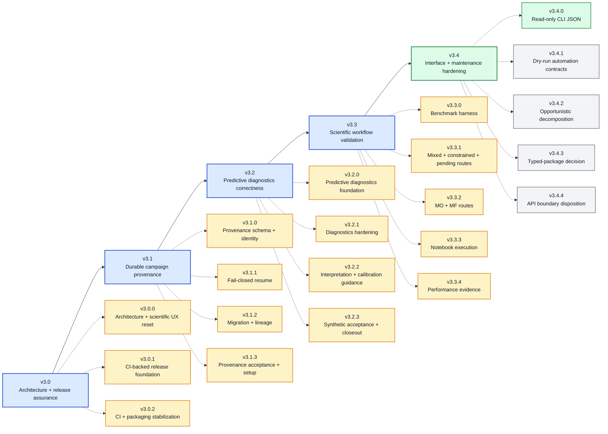

# BO Forge v3.x Roadmap

This roadmap is directional, not a release promise. The v3.x train focuses on
assurance, reproducibility, scientific validation, and maintainability around
the local YAML/CSV campaign model rather than primarily expanding features.

Current prepared baseline: `v3.4.0`. The v3.4.x interface line is active, with
versioned JSON inspection prepared for local and exact-commit validation.
Implementation is complete for v3.3.4 and
the v3.3.x series. Performance acceptance passed: 156/156 processes completed
and all 13 case pairs validated. The local release gate must pass before commit;
exact-commit CI remains pending. The archive-bound same-host comparison against
`6c0d57db` is recorded in
[Performance Benchmarks](docs/PERFORMANCE_BENCHMARKS.md).
The verified v3.3.3 notebook baseline passed all 20 notebooks, with archive
`466a48c15347e5d8c4d2635afddbeb85acf53c693bd26dc856e47aa6b0fc9f40`
and evidence under `reports/notebooks/v3.3.3/seed-baseline-fix/`.
That result does not certify a rebuilt candidate. Source-only notebook assurance
retains PR, manual full, and exact-tag archive-bound execution gates. See
[Notebook Execution](docs/NOTEBOOK_EXECUTION.md).
The source-only benchmark harness adds
coupled qLogEHVI hypervolume and continuous qMFKG observed-target quality/cost
evidence, with separately labeled scoring-only oracle diagnostics. It retains
continuous single-objective comparisons with mixed, constrained, and pending-aware
routes plus evidence-integrity and cancellation-timing fixes. Local acceptance
retained 40 complete and five failed standard trials. Historical v3.3.0 acceptance completed
90/90 trials; this does not establish general BO superiority.
The completed v3.2.x diagnostic line does not establish universal calibration.
Completed statuses describe implementation, not publication approval. Release
publication still requires exact-commit CI and separate authorization.

## Roadmap So Far

### Patch Plan

| Version | Status | Summary |
| --- | --- | --- |
| `v3.0.0` | implemented | Architecture and scientific-UX reset with compatibility facades |
| `v3.0.1` | prepared | Reproducible environments, required CI, tag gate, and release-process hardening |
| `v3.0.2` | prepared | Canonical API factory probes and independent package-extra validation |
| `v3.1.0` | prepared | Versioned campaign manifests, mutation ledger, and managed transaction recovery |
| `v3.1.1` | prepared | Fail-closed resume policy, mismatch classification, and explicit recovery |
| `v3.1.2` | prepared | Explicit adoption, migration, config formatting acceptance, and lineage |
| `v3.1.3` | implementation complete | Lifecycle acceptance, beginner setup, and package verification |
| `v3.1.x` | completed | Durable campaign provenance and lineage |
| `v3.2.0` | prepared | Complete foundation: in-sample labels, explicit metadata, bounded predictive evaluation |
| `v3.2.1` | prepared | Atomic exports, failure visibility, and evaluation snapshots |
| `v3.2.2` | prepared | Practical interpretation and calibration guidance, not calibration certification |
| `v3.2.3` | implementation complete | Known-distribution diagnostic acceptance and series closeout |
| `v3.2.x` | completed | Predictive diagnostics, hardening, interpretation, and acceptance; not universal calibration |
| `v3.3.0` | prepared | Source-only continuous benchmark harness; 90/90 local standard trials complete |
| `v3.3.1` | prepared | Evidence integrity, cancellation timing, mixed/constrained/pending routes; 40 complete and 5 failed standard trials retained |
| `v3.3.2` | prepared | 30/30 local MO/MF standard trials complete; worse qMFKG observed-target quality retained separately from oracle diagnostics |
| `v3.3.3` | prepared | Verified 20/20 full-profile notebook baseline; archive-bound acceptance, separate from candidate CI |
| `v3.3.4` | implementation complete | Performance acceptance passed: 156/156 processes, 13/13 valid pairs; exact-commit CI remains separate |
| `v3.3.x` | completed | Implementation complete; notebook 20/20 and performance acceptance verified, not publication approval |
| `v3.4.0` | prepared | Schema-v1 JSON for 16 read-only CLI commands; text and BO contracts unchanged |
| `v3.4.x` | active | Structured automation interfaces and maintenance decisions |

## v3.0.x - Architecture And Release Assurance

Status: completed

### v3.0.0 - Architecture And Scientific UX Reset

Status: implemented

- Preserve documented top-level APIs, YAML/CSV formats, numerical routing, and
  local workflow semantics.
- Separate configuration, campaign, optimization, diagnostics, application,
  Streamlit, and optional API ownership behind compatibility entrypoints.
- Replace the five-panel workbench with `Campaign`, `Run`, and `Analyze`.
- Standardize scoped scientific figure styling and semantic colors.
- Add architecture, complexity, import-boundary, public-signature, and UI
  behavior-freeze tests.
- Document compatibility facades, navigation mapping, API isolation, and visual
  changes in `docs/MIGRATION_V3.md`.

### v3.0.1 - CI-Backed Release Foundation

Status: prepared; publication requires separate authorization and exact-commit CI

Audit mapping: `REL-001`, `REP-002`, `DOC-001`, `DOC-002`, `DX-001`.

- Generate hashed, fully resolved Python 3.11/3.12 constraints with a pinned
  resolver and explicit Linux/macOS platform targets.
- Require Linux Python 3.11 and 3.12 full-suite CI.
- Add economical macOS 3.12 coverage for canonical/symlink paths, file locks,
  stale fingerprints, atomic replacement, rollback, mode preservation, and
  thread/process mutation paths.
- Run Ruff, syntax/metadata checks, and the complete existing pytest suite.
- Build wheel and sdist through PEP 517 in runner-temporary storage and verify
  both with Twine and package-boundary contracts.
- Install wheel and sdist outside the checkout under the selected constraints,
  run `pip check`, and prove imports resolve from installed artifacts.
- Smoke packaged `bo-forge`, `bo-forge-app`, and `bo-forge-api` entrypoints
  without starting unbounded servers or exposing non-loopback listeners.
- Run representative real BoTorch qMFKG paths in a separate CPU-only bounded
  job rather than in every fast validation job.
- Add a future `v*` tag gate that verifies tag/version identity, builds from the
  exact tagged commit, and retains private workflow artifacts without creating
  a release or publishing to a registry.
- Remove author-home paths from release-facing docs and notebooks and enforce a
  precise regression scan.
- Add `CONTRIBUTING.md` and `SECURITY.md`.
- Make production API/database limitation wording version-neutral.
- Change package maturity metadata to Beta and align authoritative version
  sources at `3.0.1` only after the foundation passes local validation.
- Keep branch/tag protection as a separately configured GitHub repository
  setting; repository workflow files do not prove server-side protection.
- Do not tag, publish, upload public release assets, or write the final release
  announcement as part of this milestone implementation.

Acceptance criteria:

- [ ] All generated constraints pass structural/freshness checks.
- [ ] Required Linux, macOS, package, entrypoint, and numerical CI jobs are
  represented in repository workflows with least-privilege permissions and
  bounded timeouts.
- [ ] Clean Python 3.12 local preflight passes; Python 3.11 remains a required
  CI result rather than an unverified local claim when unavailable.
- [ ] Wheel/sdist metadata, contents, and external installs pass.
- [ ] Release-facing files contain no private author-home paths.
- [ ] Version, maturity classifier, changelog, roadmap, docs, and artifact names
  agree on the prepared release identity.
- [ ] No tag, GitHub Release, package publication, or push occurs.

### v3.0.2 - CI And Packaging Stabilization

Status: prepared; publication requires separate authorization and exact-commit CI

- Standardize installed-artifact validation on the existing
  `bo_forge_api.api:create_app` factory without expanding the package-root API.
- Apply the canonical factory smoke to required CI and the future exact-tag
  validation workflow.
- Test core wheel, Streamlit app-extra, FastAPI extra, and source-distribution
  installations independently outside the source checkout.
- Derive release identity and artifact names from project metadata where
  practical and keep release-assurance tests version-neutral.
- Preserve dependency constraints unless a reproducible resolver or platform
  failure proves a pin invalid.
- Add no scientific feature, campaign combination, schema, endpoint, CLI, UI,
  or public API expansion.
- Mark v3.0.x complete only after every required CI job passes on the exact
  v3.0.2 commit.
- No tag, GitHub Release, package publication, or push occurs as part of local
  preparation.

## v3.1.x - Durable Campaign Provenance

Status: completed

Audit mapping: `REP-001`.

### v3.1.0 - Provenance Schema And Campaign Identity

Status: prepared; publication requires separate authorization and exact-commit CI

- Adds a versioned sidecar manifest without replacing YAML/CSV source data.
- Records exact config bytes/hash, normalized semantic config identity, current
  log hash/row count, optimization identity, and bounded environment snapshots.
- Records append-only initialization and mutation events with ordered row IDs,
  environment identity, and previous/resulting log hashes.
- Coordinates managed CSV/manifest writes under the existing canonical log
  lock with rollback and deterministic pending-transaction recovery.
- Verifies present manifests against current config and log identity during load and
  resume, with read-only mismatch diagnostics and fail-closed managed sessions.
- Exposes opt-in initialization and read-only provenance through Python, CLI,
  reports, Streamlit, the application service, and the experimental API.
- Leaves existing campaigns manifest-free and behavior-compatible; explicit
  adoption remains reserved for v3.1.2.
- Adds no BO algorithm, YAML key, CSV column, campaign combination, notebook,
  authentication mechanism, or tamper-proof audit claim.

### v3.1.1 - Fail-Closed Resume Semantics

Status: prepared; publication requires separate authorization and exact-commit CI

- Adds `compatible` and `required` loading policies without changing the legacy
  default or allowing present manifests to be ignored.
- Classifies byte-only config edits, semantic config changes, log identity and
  row-count changes, path mismatches, and pending transaction states with stable
  reason codes and recovery actions.
- Reports current environment drift as non-blocking diagnostic information.
- Replaces implicit next-write transaction repair with explicit, lock-protected
  `recover_provenance()` and `bo-forge provenance-recover` workflows.
- Propagates strict loading and explicit recovery through the application
  service, Streamlit, CLI, and root-bounded experimental API.
- Preserves schema-v1 manifests, legacy reports, BO behavior, YAML/CSV schemas,
  and established mutation atomicity.

### v3.1.2 - Explicit Migration And Lineage

Status: prepared; publication requires separate authorization and exact-commit CI

- Explicitly adopt legacy data with unknown earlier history, without modifying YAML/CSV.
- Migrate v1 manifests to v2 with exact immutable archives; initialize new campaigns in v2.
- Accept formatting-only config changes after semantic equality checks and explicit migration.
- Fork coherent campaigns into new directories with inherited CSVs and captured parent snapshots.
- Restrict child changes to campaign name, BO settings, and model profile under existing validation.
- Require preview identities and reasons on apply; retain explicit recovery and reject force overrides.

### v3.1.3 - Provenance Acceptance And Beginner Setup

Status: implementation complete; publication requires separate authorization and exact-commit CI

- Freeze legacy, v1, initialized v2, adopted, migrated, and forked lifecycle
  behavior, including explicit recovery and independent captured child lineage.
- Include provenance filesystem and process races in macOS CI and bounded
  lifecycle acceptance in existing wheel/sdist probes.
- Preserve later committed writes during initialization rollback, reject malformed
  event types, and align recovery guidance with explicit lifecycle actions.
- Add `START_HERE.md` for beginner local installation, launch, and reopening;
  distinguish setup from campaign operation and provenance reference material.
- Keep BO capabilities, schemas, interfaces, and optional dependencies unchanged.

## v3.2.x - Predictive Diagnostics Correctness

Status: completed; diagnostic acceptance is not universal model calibration or publication approval

### v3.2.0 - Predictive Diagnostics Foundation

Status: prepared; publication requires separate authorization and exact-commit CI

Audit mapping: `ARC-001`, diagnostics foundation of `SCI-001`.

- Retain existing comparison columns and add `evaluation_scope=in_sample`;
  distinguish training diagnostics from held-out predictive evidence everywhere.
- Remove ambient fit history from `model_summary(config, df, *, metadata=None)`;
  keep fit metadata explicitly owned by the session without changing BO numerics.
- Add `model_predictive_evaluation` and `PredictiveEvaluationResult` with summary,
  prediction, fold-outcome, and metadata outputs, explicit export, and two plots.
- Add explicit Python/session, `bo-forge model-evaluate`, and Streamlit evaluation
  entrypoints; do not run evaluation automatically or select a profile.
- Restrict evaluation to standard single-objective campaigns with 5..200 observed
  rows, 2..5 folds, at least two training rows per fold, and no duplicate designs.
  Reject context, replicates, stages, fidelity, and multi-objective campaigns.
- Include observation noise in predictive variance and restore original objective
  units; preserve visible failures and state small-sample interpretation limits.
- Add a compact output-free tutorial with 20 synthetic observations in a temporary
  directory, profiles `default`/`smooth`, and three folds; no fixture or dependency changes.

### v3.2.1 - Diagnostics Hardening

Status: prepared; publication requires separate authorization and exact-commit CI

- Publish the four evaluation files atomically without overwrite, with retry from
  retained results and unchanged provenance-fork publication behavior.
- Append summary failure messages, use safer equivalent reductions, and expose
  incomplete/warning notices through CLI and Streamlit without hiding fold evidence.
- Isolate config/data snapshots; check loaded config/log/manifest identity before
  and after evaluation across Python, CLI, and service.
- Cover interleaved fit ownership, stale inputs, export rollback, and publication
  races in the existing Linux/macOS gates. Preserve suggestions, evaluation bounds,
  campaign combinations, fitting RNG/retries, and existing diagnostic columns.

### v3.2.2 - Interpretation And Calibration Guidance

Status: prepared; publication requires separate authorization and exact-commit CI

- Add a reading sequence, fair-comparison limits, uncertainty patterns, and a
  manual split-sensitivity protocol based on primary literature.
- Extend notebook 23 through Markdown only and add a static Streamlit reference;
  preserve computation cells, evaluator behavior, exports, and state ownership.
- Verify hand-worked arithmetic and display-only behavior. This guidance does
  not establish scientific calibration; synthetic acceptance is covered by v3.2.3.
- Keep evaluation opt-in and avoid composite scores or automatic profile selection.

### v3.2.3 - Synthetic Acceptance And Interpretation Contract

Status: implementation complete; publication requires separate authorization and exact-commit CI

Audit mapping: diagnostics portion of `SCI-001`.

- Test matched, too-narrow, too-wide, and biased known Gaussian predictions
  through the public evaluator with independent midpoint-quantile arithmetic.
- Verify complete/incomplete results across existing adapters, plots, and exports.
- Separate deterministic diagnostic correctness from bounded real-GP integration;
  run both in CI and evaluate a small campaign from installed wheel/sdist artifacts.
- Preserve notebook 23 and all evaluator/campaign contracts. No automatic ranking,
  calibration certification, or closed-loop performance claim is introduced.
- Keep empirical calibration and the v3.3.x workflow benchmark distinct from this closeout.

## v3.3.x - Closed-Loop Scientific And Workflow Validation

Status: completed

Implementation is complete; notebook and paired performance acceptance are verified.
The local release gate must pass before commit. Exact-commit CI remains pending,
and publication requires separate authorization.

Audit mapping: closed-loop portion of `SCI-001`, plus `TST-001` and `PERF-001`.

### v3.3.0 - Benchmark Harness Foundation

Status: prepared; publication requires separate authorization and exact-commit CI.
Local standard acceptance completed 90/90 trials and 2,160 evaluations; retained
evidence and interpretation limits are recorded in the benchmark guide.

- Versioned specs cover continuous Branin, Hartmann3, and Hartmann6 against
  random and Sobol baselines in deterministic and noisy modes.
- The six-trial smoke uses seed 0, four initial/six total evaluations, and four
  BO suggestion calls. The standard uses seeds 0 through 4, `2 * (d + 1)` initial
  observations, and 24 total evaluations across 90 trials; it is opt-in.
- Sequential trials have a 600-second timeout. Retain planned IDs, config/log
  provenance, status, partial traces, and worker logs; disclose failures and
  condition summary quality metrics on completed trials.
- Keep `benchmarks/` source-only, included in the sdist but not the runtime
  wheel. The smoke notebook uses a temporary workspace; report regeneration is
  fitting-free and objective-free. See [Benchmarks](docs/BENCHMARKS.md).
- Preserve BO, Streamlit, and public API behavior. Separate measured local
  evidence from general performance claims and exact-commit CI approval.

### v3.3.1 - Mixed, Constrained, And Pending-Aware Noisy Routes

Status: prepared; local acceptance and constrained-BO failures recorded. Publication requires separate
authorization and exact-commit CI.

- Bind report evidence to scheduled configuration, sources, seed mapping, and
  inputs; retain cancellation elapsed time and distinguish unknown timing from zero.
- Add schema-v2 `mixed` and `constrained_mixed` routes on `mixed_quadratic`,
  plus `pending_noisy` on noisy Branin (`noise_std: 1.0`, `qlog_nei`, `X_pending`).
- Six route specs plan 9 smoke trials/54 evaluations (seed 0, 4 initial/6 total)
  and 45 standard trials/1,080 evaluations (seeds 0 through 4, 24 total;
  8 initial for mixed routes and 6 for pending). Counts are budgets, not results.
- Preserve schema-v1 specs and historical evidence, the original CI smoke, and
  notebook #24 computational cells. Add route smokes to numerical CI and opt-in
  Markdown notebook instructions; keep tooling source-only and outside the wheel.
- Report feasibility, pending rows, failures, and runtime without weakening
  assertions or changing production capability statuses. Record inspected
  acceptance in [Benchmarks](docs/BENCHMARKS.md), including retained failures
  and the limits of these controlled comparisons.

### v3.3.2 - Multi-Objective And Multi-Fidelity Routes

- Add schema-v3 deterministic Branin-Currin/qLogEHVI hypervolume with reference
  point [18, 6], not an exact hypervolume-regret claim.
- Add continuous Augmented Branin/qMFKG observed-target regret and affine
  modeled-cost evidence; target-only baselines after shared initialization.
- Keep oracle target projection scoring-only, with separate time accounting.
  Fixed-count endpoints are not equal-cost comparisons or recommendation quality.
- Smoke: 6 trials / 36 evaluations. Standard: 30 trials / 600 evaluations;
  retain failures, partial evidence, and timing completeness without retries.
- Preserve v1/v2 evidence and all five historical constrained-BO failures.
  Local acceptance completed 30/30 standard trials and 6/6 new smokes, retaining
  qMFKG's lack of new target observations and worse observed-target quality.
  See [measured acceptance](docs/BENCHMARKS.md); capability statuses are unchanged.

### v3.3.3 - Full Notebook Execution

Status: prepared; local execution acceptance and exact-commit CI are separate gates.
The verified baseline completed all 20 notebooks; the archive identity and retained
evidence path are recorded above. Earlier failed attempts remain separate evidence.

- Execute every notebook from a clean source archive in temporary workspaces.
- Enforce bounded timeouts and no tracked-file writes.
- Keep committed notebooks output-free. PR CI covers 01, 04, 08, 12, 14, 18,
  20, 22, 23, and 24; manual and exact-tag workflows cover all 20 notebooks.
- Use one notebook per job, a 90-minute job timeout, no fail-fast, and at most
  two concurrent jobs. Reuse the one built sdist for execution and aggregation.
- Bind each `result.json` to `archive_sha256`, record its schedule and notebook
  statuses, and fail aggregation on missing jobs or unsuccessful evidence.
  See [Notebook Execution](docs/NOTEBOOK_EXECUTION.md). Prepared infrastructure
  does not establish a completed run or publication approval.

### v3.3.4 - Stable Performance Evidence

Status: implementation complete; performance acceptance passed (156/156 processes,
13/13 valid case pairs). The local release gate must pass before commit.
Exact-commit CI remains pending; publication is a separate gate.

- Compare baseline `6c0d57db` and candidate sdists on one host, using isolated
  non-editable environments and excluding environment preparation from timings.
- Schedule 13 import/startup and representative q=1/2/4 cases, two versions, and
  six fresh-process samples per case/version: 156 processes. Limit each process
  to 600 seconds and the overall harness to 90 minutes.
- Use one manual-only Ubuntu 24.04 / Python 3.12 job with a 120-minute timeout,
  existing hashed constraints, and always-uploaded evidence retained for 14 days.
  Full performance runs are not PR CI.
- Record archive and environment identities, failure counts, timing variation,
  and available memory evidence. Keep ratios advisory and historical timings
  noncomparable; neither timing nor notebook success establishes BO superiority.
- Retain measured results in [Performance Benchmarks](docs/PERFORMANCE_BENCHMARKS.md):
  process ratios 0.9660-1.0822, public-call ratios 0.9012-1.0794, and peak-RSS
  ratios 0.9939-1.0086. These do not establish speedup or scientific superiority.
  The evaluated candidate archive predates report-validation and
  interruption-checkpoint fixes plus closeout docs. The measurement worker,
  workloads, and production code are unchanged; the regenerated report validates
  the preserved original samples. Acceptance is bound to those archive bytes,
  not a final commit or rebuilt sdist.

## v3.4.x - Interface And Maintenance Hardening

Status: active

### v3.4.0 - Versioned CLI JSON For Read-Only Commands

Audit mapping: first half of `UX-001`.

- Prepared schema-v1 JSON for validate, summary, status, next-action, cost,
  replicate, stage, context, fidelity summary/coverage, qLogNEI summary, model
  summary/comparison, Pareto front/summary, and provenance.
- Preserve text defaults, exit codes, capability checks, and read-only behavior;
  separate stdout data from stderr diagnostics, including parser failures.
- Publish schema/golden fixtures and compatibility, provenance, and installed
  entrypoint checks. No BO support status changes or HTTP additions.

### v3.4.1 - Structured Dry-Run And Automation Contracts

Audit mapping: second half of `UX-001`.

- Reuse the v3.4.0 envelope and error format for structured suggestion dry-run
  output and subsequent automation contracts; do not introduce a competing format.
- Add golden/schema tests without changing explicit append semantics.

### v3.4.2 - Opportunistic Module Decomposition

Audit mapping: `MNT-001`.

- Split modules only when touched by real work.
- Prioritize CLI command groups, API stage lifecycle/storage, session read/write
  responsibilities, and validation domains.
- Preserve public compatibility and explicitly reject a wholesale rewrite.

### v3.4.3 - Typed-Package Product Decision

Audit mapping: `DX-002`.

- Decide whether typing is a public compatibility promise.
- If yes, add focused type checking and `py.typed` only after the supported
  surface passes; if no, document the boundary honestly.

### v3.4.4 - API Product-Boundary Disposition

Audit mapping: `OPS-001`.

- Keep the FastAPI adapter experimental by default.
- Preserve loopback defaults, trusted-network warnings, process-local stages,
  and non-multi-worker limitations.
- Add negative tests preventing accidental production-security claims.
- Treat a true production backend as a separate architecture milestone,
  probably outside this local-first v3 train, requiring durable transactional
  storage, authenticated identity, authorization, idempotency, rate limiting,
  persistent audit, multi-worker coordination, backup/restore, and deployment
  observability.

## Roadmap-Wide Definition Of Done

The v3.x train is complete only when evidence supports all applicable items:

- [ ] Exact release commit is validated before an exactly matching tag is
  created.
- [ ] Python 3.11 and 3.12 are required CI, with Linux full-suite and macOS core
  filesystem coverage.
- [ ] Wheel and sdist install from outside the source checkout.
- [ ] Durable campaign provenance and fail-closed semantic mismatch handling
  exist with explicit legacy migration.
- [ ] Training fit and predictive validation are clearly separated.
- [ ] Repeated-seed closed-loop baselines cover representative scientific paths.
- [ ] Notebooks execute in temporary workspaces while Git copies stay clean.
- [ ] CLI structured output is versioned and tested.
- [ ] Global mutable fit metadata is removed.
- [ ] API security and deployment limits remain explicit and evidence-aligned.
- [ ] Release-facing files contain no author-home paths.
- [ ] Contributor and security reporting guidance stays current.
- [ ] Maturity and capability claims match the available evidence.

Status vocabulary in this roadmap is deliberate: **implemented** means present
and tested in the repository; **planned** is directional; **conditional** may
be skipped; **deferred** belongs to a later decision; and **out of scope** is
explicitly excluded from the named milestone.
